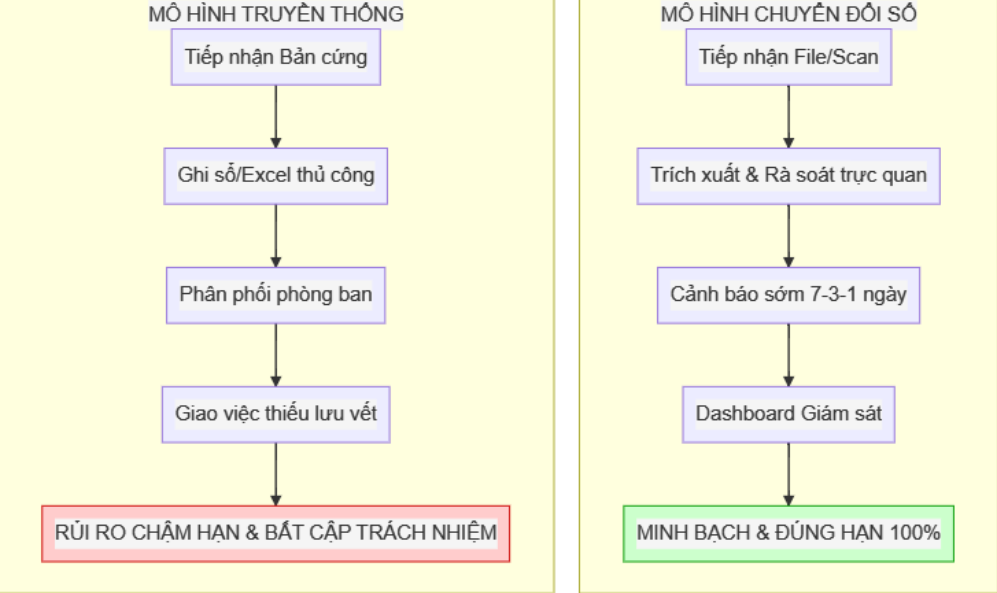

  <!-- Khối Metadata -->
  

    
Mô tả Yêu cầu Nghiệp vụ

    

      

        Tên dự án:Hệ thống điều phối công văn
      

      

        Đơn vị chủ quản:Link Strategy
      

      

        Quản trị dự án:Lê Đức Anh (0399945440)
      

    

  
<!-- QUAN TRỌNG: KHÔNG ĐỂ KHOẢNG TRẮNG Ở ĐÂY -->

    <!-- Khối Branding Badge -->
    

      
      

        

          LINK STRATEGY
        

        
OPERATION SOLUTIONS

      

    

  

# ĐỀ XUẤT: HỆ THỐNG ĐIỀU PHỐI CÔNG VĂN

---

### I. TỜ TRÌNH ĐỀ XUẤT: TẦM NHÌN & MÔ HÌNH CHIẾN LƯỢC

Trong bối cảnh hệ thống chính quyền đẩy mạnh chuyển đổi số tới tận cấp cơ sở, việc đôn đốc thực thi văn bản chỉ đạo của Lãnh đạo Ủy ban là nhiệm vụ trọng tâm nhằm rèn luyện kỷ cương hành chính. Giải pháp **Hệ thống điều phối công văn** là chìa khóa định vị **"Cánh tay nối dài của Lãnh đạo"**, giúp chuyển dịch từ "chỉ đạo đôn đốc thủ công" sang "giám sát chủ động". Đây đồng thời là **"Mô hình điểm"** xuất sắc để địa phương báo cáo thành tích sáng tạo công nghệ lên cấp trên.

#### 1. So sánh trực quan mô hình vận hành

#### 2. Phân tích bất cập & Giải pháp đột phá

| Điểm nghẽn hành chính hiện hành                                                                                                         | Giải pháp đột phá (Giá trị cốt lõi)                                                                                                                                    |
| :--------------------------------------------------------------------------------------------------------------------------------------------- | :------------------------------------------------------------------------------------------------------------------------------------------------------------------------------ |
| **Thao tác thủ công lặp lại:** Ghi chép văn bản vào  sổ sách/Excel gây lãng phí thời gian và nhân lực.            | **Giảm tải nghiệp vụ:** Công nghệ bóc tách dữ liệu kết hợp  giao diện rà soát song song, tối ưu hóa 90% thời gian  nhập liệu.              |
| **Chậm trễ & Khó quy trách nhiệm:** Giao việc thiếu  công cụ cảnh báo, dễ dẫn đến rủi ro trễ hạn công việc.     | **Thiết chế kỷ cương & Giám sát chủ động:** Lưu vết  100% tài liệu; hệ thống tự động nhắc hạn đa tầng (7-3-1 ngày)  đúng đích danh. |
| **Điều hành thụ động:** Cấp quản lý phải chờ báo cáo  thủ công, khó nắm bắt toàn cảnh điểm nghẽn tiến độ. | **Chỉ đạo & Điều hành trực quan:** Màn hình giám sát thời gian  thực; theo dõi sát sao luồng công việc qua chỉ báo màu  (Xanh/Vàng/Đỏ). |

#### 3. Tác động và Lợi ích thu về

* **Đối với Lãnh đạo Ủy ban:** Nắm bắt toàn cảnh tiến độ công việc; kiến tạo thành công "Mô hình điểm về Chuyển đổi số" cấp cơ sở, đóng góp trực tiếp vào Bộ chỉ số Cải cách hành chính và thành tích thi đua của địa phương.
* **Đối với Văn phòng & Cán bộ:** Giảm 60% áp lực nhập liệu; thiết lập văn hóa số hóa, xóa bỏ rủi ro chậm trễ.
* **Đối với Tổ chức:** Đảm bảo chủ quyền bảo mật dữ liệu tuyệt đối (không phụ thuộc bên thứ 3); khả năng nâng cấp và nhân rộng mô hình dễ dàng lên các cấp hành chính cao hơn.

---

### II. MỤC TIÊU CỐT LÕI VÀ BỘ CHỈ SỐ CAM KẾT

Để đánh giá tính thực tiễn và phê duyệt năng lực của hệ thống tại cấp cơ sở, các tiêu chí sau được coi là kết quả đầu ra bắt buộc:

* **Minh bạch trách nhiệm:** Hệ thống lưu vết 100% quá trình tiếp nhận và xử lý, xóa bỏ triệt để tình trạng đùn đẩy trách nhiệm giữa các cá nhân/bộ phận.
* **Tỷ lệ đúng hạn:** Phấn đấu đạt **100% văn bản** được nhắc việc và hoàn thành đúng mốc thời gian thông qua cơ chế cảnh báo tự động đa tầng.
* **Phổ cập ứng dụng:** Thiết kế giao diện thao tác trực quan, đảm bảo Cán bộ/Văn thư lớn tuổi có thể sử dụng thành thạo ngay lập tức mà không phụ thuộc vào trình độ tin học hay bắt buộc trải qua đào tạo nghiệp vụ phức tạp.
* **Làm chủ hệ thống:** Bàn giao đặc quyền quản trị cao nhất (Master/Root) cho Bộ phận CNTT chuyên trách hiện tại của Ủy ban, đảm bảo 100% chủ quyền kiểm soát an toàn thông tin và bảo vệ nguồn lực nội bộ.

---

### III. LỘ TRÌNH TRIỂN KHAI THỰC TIỄN

Lộ trình được chia làm 2 giai đoạn, lấy sự ổn định và dễ dùng làm cốt lõi trước khi nâng cấp hệ thống.

#### GĐ 1: Hoàn thiện Nền tảng & Điều phối Cơ bản

*Đề xuất triển khai thí điểm tức thời dưới hình thức phối hợp thử nghiệm nền tảng số (không sử dụng ngân sách nhà nước), đảm bảo đưa hệ thống vào giải quyết bài toán cốt lõi ngay lập tức:*

* **Số hóa & Tối ưu hóa nguồn lực:** Ứng dụng kỹ thuật trích xuất dữ liệu kết hợp giao diện đối chiếu song song, biến công việc của văn thư từ "nhập liệu thủ công 100%" sang "chỉ rà soát và bấm duyệt".
* **Kế thừa dữ liệu liền mạch:** Cung cấp bộ công cụ chuyển đổi (Migrate) tự động toàn bộ dữ liệu lịch sử từ các phần mềm/công cụ nội bộ cũ sang hệ thống mới để không lãng phí công sức đã thao tác.
* **Quản lý thời hạn xử lý:** Thiết lập kho lưu trữ văn bản tập trung trên máy chủ nội bộ, phân loại theo mốc thời gian xử lý cấp bách.
* **Cảnh báo đa tầng:** Kích hoạt hệ thống nhắc nhở tự động qua thư mục làm việc/Thông báo nội bộ trực tiếp cho các mốc 7-3-1 ngày.
* **Giao diện giám sát tổng hợp (Dashboard):** Cung cấp biểu đồ báo cáo tình trạng xử lý văn bản toàn đơn vị ngay trên màn hình của Lãnh đạo.
* **Yêu cầu Hạ tầng GĐ 1 (Tận dụng thiết bị có sẵn - Không phát sinh mua sắm):**
  * Tận dụng **01 máy tính PC văn phòng** hiện có để thiết lập máy chủ điều phối nội bộ (Local Server).
  * Tận dụng **hệ thống máy Scan/Photocopy** hiện tại của cơ quan.
  * Sử dụng mạng LAN nội bộ ổn định sẵn có, vận hành độc lập (Offline) để đảm bảo an toàn cơ bản.

#### GĐ 2: Nâng cấp Liên thông & Trí tuệ nhân tạo (Giai đoạn mở rộng)

*Chỉ triển khai mở rộng khi có Công văn thẩm định từ trên và nguồn ngân sách chủ trương từ cấp quản lý cao.*

* **Trợ lý ảo thông minh:** Phần mềm tự nhận diện mức độ khẩn cấp và đề xuất phân luồng hồ sơ tối ưu.
* **Kiến trúc liên thông đa đơn vị:** Cấu trúc nền tảng phân tách độc lập, sẵn sàng đáp ứng đồng bộ hàng loạt các Phường/Xã trên một hệ thống tập trung của Tỉnh/Quận.
* **Quy chuẩn An toàn thông tin cấp Tỉnh:** Tích hợp bộ vách ngăn bảo mật từ chối văn bản Mật/Tuyệt Mật. Thiết lập luồng sao lưu đồng bộ mã hóa (Encrypted Cloud Backup) tự động vào cuối ngày lên hệ thống Data Center của Tỉnh để chống thảm họa vật lý (cháy, hỏng PC tại cơ sở).
* **Cơ chế Kế thừa và Giải phóng dữ liệu:** Đảm bảo chuyển đổi liền mạch 100% tài nguyên từ các công cụ/phần mềm cũ tại cơ sở lên hệ thống của Tỉnh. Đồng thời, bàn giao hoàn toàn Cấu trúc dữ liệu chuẩn mở (Open Schema) cho cơ quan chuyên môn Tỉnh, giúp Lãnh đạo tự chủ việc tái sử dụng (kế thừa) lõi dữ liệu này cho các đề án tương lai mà không bị phụ thuộc vòng đời vào bất kỳ nhà cung cấp công nghệ nào.
* **Điều phối cá nhân hóa:** Tự động điều hướng thông báo nhắc việc hiển thị trực tiếp trên không gian làm việc của đúng cán bộ chịu trách nhiệm tham mưu.
* **Báo cáo phân tích tự động:** Hệ thống tự động trích xuất các biểu đồ đo lường điểm nghẽn, cung cấp số liệu hệ thống tham mưu đắc lực cho Lãnh đạo tại các kỳ họp giao ban cấp trên.
* **Yêu cầu Hạ tầng GĐ 2 (Chuẩn bị hành trang liên thông lên cấp trên):**
  * Dịch chuyển lên hạ tầng Server chung của Tỉnh/Quận lấy từ các dự án ngân sách phân bổ.
  * Tăng cường kết nối VPN bảo mật phục vụ truy cập luân chuyển văn bản liên thông nhiều cấp chính quyền.

  

    © 2026 <b style="color: #003366 !important;">Link Strategy</b>. All rights reserved. 
    <b>Document:</b> Hệ thống điều phối công văn | <b>Version:</b> 2.0.0
  
<!-- QUAN TRỌNG: KHÔNG ĐỂ KHOẢNG TRẮNG Ở ĐÂY -->

    

      

        
LINK STRATEGY

        
OPERATION SOLUTIONS

      

      
    

  

