# Tài liệu Kiến trúc Kỹ thuật — Hệ thống Điều phối Công văn (Tool-Calendar)

> **Phiên bản tài liệu**: 1.0 · **Ngày lập**: 22/08/2026 · **Nhánh phân tích**: `develop` (commit `6b29c12`)
> **Phạm vi**: toàn bộ solution `ToolCalendar.slnx` + `python-ai-service` + `gateway` + hạ tầng Docker/CI.
> **Đối tượng đọc**: Kiến trúc sư, Tech Lead, DevOps, thành viên mới onboard.

---

## Mục lục

1. [Tổng quan & bối cảnh hệ thống](#1-tổng-quan--bối-cảnh-hệ-thống)
2. [Kiến trúc mức Container (C4 L2)](#2-kiến-trúc-mức-container-c4-l2)
3. [Kiến trúc triển khai & topology mạng](#3-kiến-trúc-triển-khai--topology-mạng)
4. [Kiến trúc Backend (.NET)](#4-kiến-trúc-backend-net)
5. [Pipeline xử lý HTTP request](#5-pipeline-xử-lý-http-request)
6. [Kiến trúc Bảo mật & Xác thực](#6-kiến-trúc-bảo-mật--xác-thực)
7. [Luồng nghiệp vụ 1 — Upload & xử lý tài liệu (OCR + RAG Index)](#7-luồng-nghiệp-vụ-1--upload--xử-lý-tài-liệu-ocr--rag-index)
8. [Kiến trúc AI / RAG](#8-kiến-trúc-ai--rag)
9. [Kiến trúc Thông báo (Real-time & Push)](#9-kiến-trúc-thông-báo-real-time--push)
10. [Mô hình dữ liệu](#10-mô-hình-dữ-liệu)
11. [Máy trạng thái nghiệp vụ](#11-máy-trạng-thái-nghiệp-vụ)
12. [Kiến trúc Frontend](#12-kiến-trúc-frontend)
13. [Ma trận phân quyền (RBAC)](#13-ma-trận-phân-quyền-rbac)
14. [Danh mục API](#14-danh-mục-api)
15. [CI/CD & Quality Gates](#15-cicd--quality-gates)
16. [Thuộc tính phi chức năng (NFR)](#16-thuộc-tính-phi-chức-năng-nfr)
17. [Rủi ro kiến trúc & nợ kỹ thuật](#17-rủi-ro-kiến-trúc--nợ-kỹ-thuật)
18. [Khuyến nghị lộ trình cải tiến](#18-khuyến-nghị-lộ-trình-cải-tiến)
19. [Phụ lục](#19-phụ-lục)

---

## 1. Tổng quan & bối cảnh hệ thống

### 1.1. Mục tiêu hệ thống

Hệ thống quản lý — giám sát — điều phối **công văn hành chính** cho cơ quan nhà nước (Văn phòng Đoàn ĐBQH & UBND TP Cẩm Phả), gồm 4 năng lực cốt lõi:

| Năng lực | Mô tả kỹ thuật |
|---|---|
| **Số hóa văn bản** | Upload PDF/Office/ảnh → trích xuất toàn văn (Docling/OCR) → bóc tách metadata (số hiệu, ngày, trích yếu, thời hạn) bằng LLM + regex fallback |
| **Điều phối & luân chuyển** | Giao việc theo phòng ban/cán bộ, cây luân chuyển đa cấp (chủ trì / phối hợp), nộp minh chứng hoàn thành |
| **Giám sát thời hạn 7-3-1** | Worker quét hạn mỗi ngày, đẩy thông báo đa kênh tại mốc còn 7 / 3 / 1 / 0 ngày |
| **Trợ lý AI hội thoại** | RAG trên kho công văn (hybrid search + rerank + MMR), agent gọi tool, semantic cache, bộ nhớ dài hạn |

### 1.2. Sơ đồ bối cảnh (C4 Level 1)

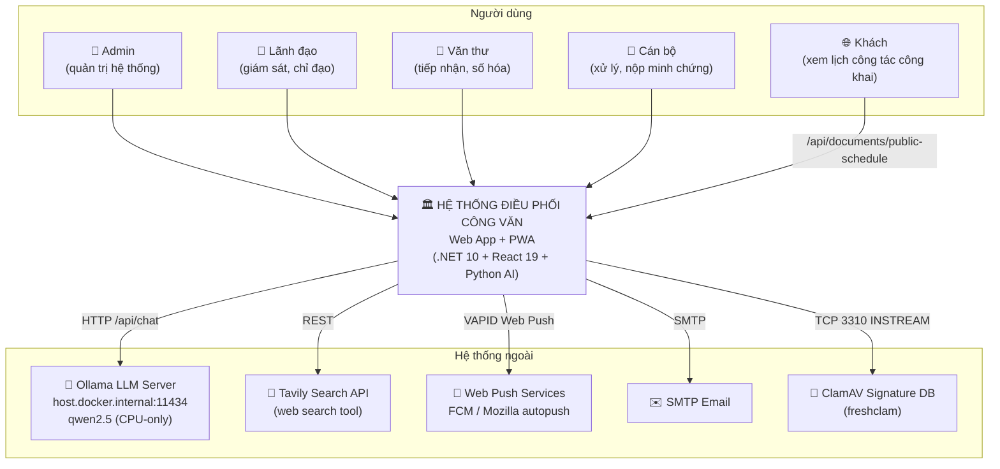

### 1.3. Bảng công nghệ (Technology Radar)

| Lớp | Công nghệ | Phiên bản | Ghi chú kiến trúc |
|---|---|---|---|
| Frontend | React + Vite + Tailwind + shadcn/ui | 19 / 7 / v4 | SPA, build ra `wwwroot`, PWA (`vite-plugin-pwa`) |
| Realtime client | `@microsoft/signalr` | 10 | WebSocket, fallback SSE |
| Backend | ASP.NET Core MVC (Controllers) | .NET 10 | 2 project: `Api` (host) + `Core` (domain/data) |
| Data access | **ADO.NET thuần** (`Microsoft.Data.Sqlite`) | 9.0.4 | **Không dùng EF Core** — repository viết SQL tay |
| DB | SQLite | file `documents.db` | `journal_mode=DELETE`, `Cache=Shared`, pooling |
| Identity | `Microsoft.Extensions.Identity.Core` + Custom UserStore | 9.0.0 | Identity **không có** EF Core store |
| Message queue | RabbitMQ | 3-management-alpine | queue `ocr_document_queue`, durable, prefetch 8 |
| AI service | FastAPI + Uvicorn | 0.111 / py3.11 | 1 worker (chia sẻ global state) |
| Embedding | sentence-transformers `paraphrase-multilingual-MiniLM-L12-v2` | 384 dims | CPU, batch embedder |
| Rerank | `cross-encoder/ms-marco-MiniLM-L-2-v2` | ~40MB | CrossEncoder 2-stage retrieval |
| Extract | Docling + pypdf | ≥2.0 | table/heading-aware parse |
| LLM | Ollama `qwen2.5:1.5b` / `qwen2.5:3b` | — | chạy trên **host**, không containerized |
| AV | ClamAV | latest | container riêng, TCP INSTREAM |
| Gateway | Nginx alpine | — | **compose độc lập** (`gateway/`), TLS wildcard |
| Monitoring | Uptime Kuma | v1 | port 3001 |
| CI/CD | GitHub Actions + SSH | — | deploy on push `develop` |

---

## 2. Kiến trúc mức Container (C4 L2)

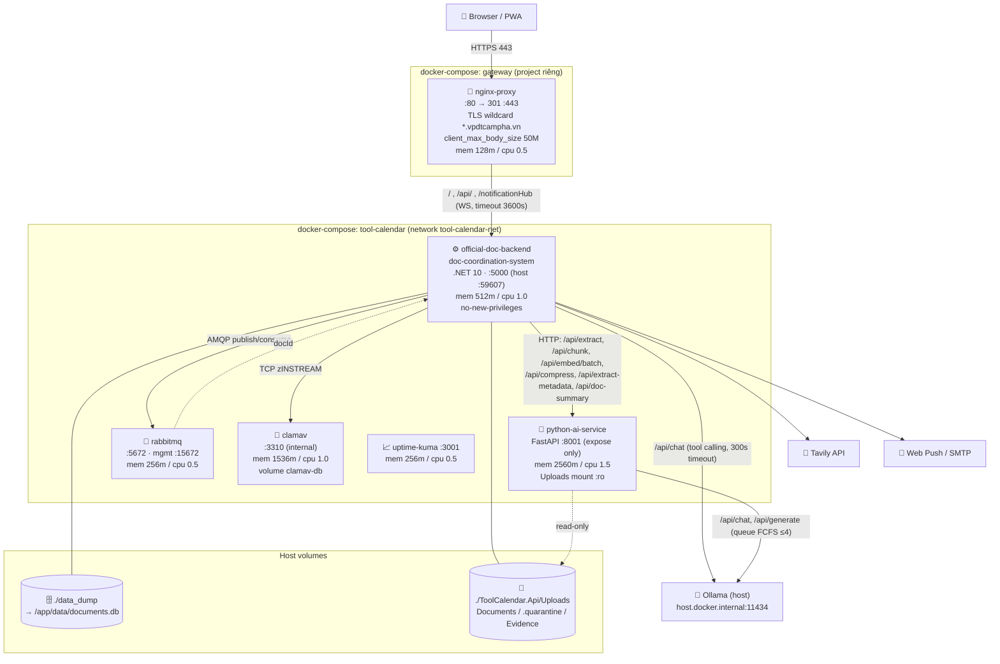

### 2.1. Nguyên tắc phân rã container

| Quyết định | Lý do | Hệ quả |
|---|---|---|
| Tách Nginx thành compose **độc lập** (`gateway/`) | Gateway phục vụ **3 subdomain** (`congvan`, `lichcongtac`, `lichcongtacvp`) của nhiều app khác nhau → deploy/rollback độc lập với app | Network `tool-calendar_tool-calendar-net` khai báo `external: true`; nếu compose chính bị `down` → gateway mất upstream |
| Tách Python AI thành service riêng | Torch + sentence-transformers + Docling cần ~2.5GB RAM, deploy chậm (~5–10 phút build) → không được kéo backend chậm theo | CI có logic **chỉ rebuild Python khi `python-ai-service/` thay đổi** |
| ClamAV container riêng | Cô lập engine quét virus khỏi tiến trình backend; DB signature persist qua named volume | Backend chỉ giữ TCP client mỏng (`ClamAvService`) |
| Ollama chạy trên **host**, không container | Tận dụng RAM/CPU host, tránh lặp model weights trong image | Phụ thuộc `extra_hosts: host.docker.internal:host-gateway` |
| RabbitMQ đứng giữa Upload và OCR | Upload trả `200` trong ~100ms; OCR nặng (2–3 phút) chạy nền, chịu được restart (`durable` + `Persistent`) | Có fallback in-process `Task.Run` nếu broker down |

---

## 3. Kiến trúc triển khai & topology mạng

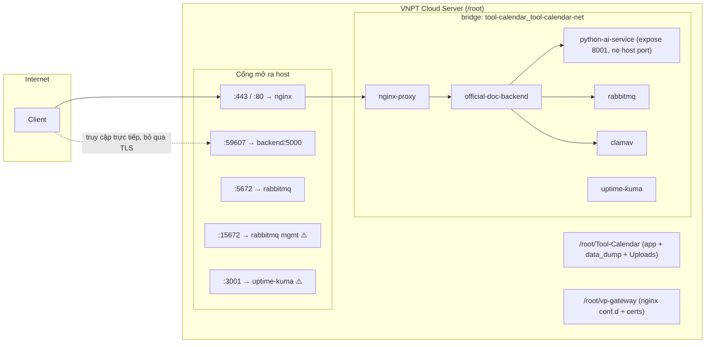

### 3.1. Bảng định tuyến Nginx

| Server name | Location | Upstream | Đặc thù |
|---|---|---|---|
| `congvan.vpdtcampha.vn` | `/` | `official-doc-backend:5000` (DNS nội bộ Docker) | `Upgrade`/`Connection` cho WS; timeout 300s |
| `congvan.vpdtcampha.vn` | `/notificationHub` | idem | `proxy_read_timeout 3600` cho SignalR |
| `congvan.vpdtcampha.vn` | `/api/` | idem | timeout 300s |
| `lichcongtac.vpdtcampha.vn` | `/`, `/appHub`, `/api/` | `host.docker.internal:59608` | app khác (ngoài repo này) |
| `lichcongtacvp.vpdtcampha.vn` | `/`, `/appHub`, `/api/` | `host.docker.internal:8081` | app khác |

Tất cả server block: TLS 1.2/1.3, cert wildcard `STAR_vpdtcampha_vn`, HTTP→HTTPS 301, `X-Forwarded-Proto https`.

### 3.2. Chuỗi build image backend (multi-stage)

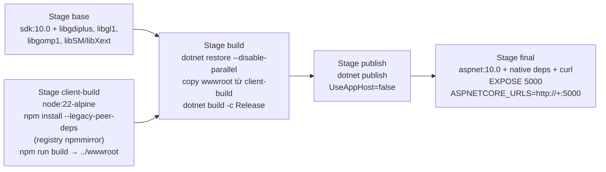

> **Điểm chú ý**: frontend được build **bên trong** Docker (stage 2) và copy vào `wwwroot` của stage build — nên `wwwroot` trong repo chỉ là artefact dev, không phải nguồn chân lý khi deploy.

---

## 4. Kiến trúc Backend (.NET)

### 4.1. Phân lớp

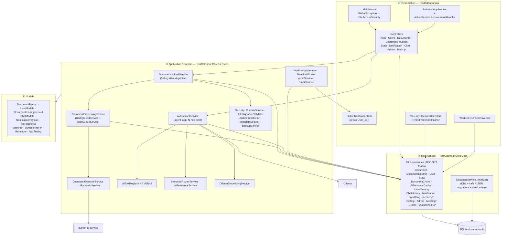

### 4.2. Vòng đời DI (Program.cs)

| Lifetime | Thành phần | Ghi chú |
|---|---|---|
| `Singleton` | `DocumentProcessingService` (đồng thời là `IOcrQueueService` + `IHostedService`), `EmailService`, `VapidService`, `ClamAvService`, `DeadlineWorker` | `DocumentProcessingService` đăng ký 3 lần cùng 1 instance qua factory `sp.GetRequiredService<>` — pattern đúng để tránh 2 instance/2 connection RabbitMQ |
| `HostedService` | `DocumentProcessingService`, `DeadlineWorker`, `ReminderWorker`, `BackupService` | 4 background loop |
| `Scoped` | Toàn bộ 18 repository, `IAiAssistantService`, `AiToolRegistry`, 5 `IAiTool`, `IDocumentUploadService`, `IDocumentExtractorService`, `IPasswordHasher<User>` | Worker phải tự `CreateScope()` |
| `HttpClient (typed)` | `IPythonAiService` (BaseAddress từ config, **Timeout 10 phút**) | Docling chạy lâu |

### 4.3. Background workers

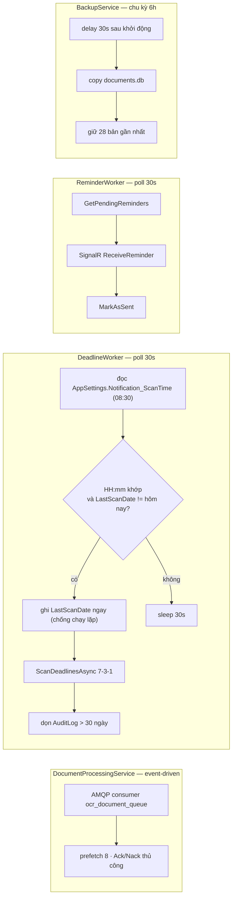

| Worker | Chu kỳ | Cơ chế chống trùng | Rủi ro |
|---|---|---|---|
| `DocumentProcessingService` | event-driven (AMQP) | `BasicQos(prefetch=8)`, `BasicNack(requeue: false)` khi lỗi | Nack không requeue → mất message nếu lỗi tạm thời; không có DLQ |
| `DeadlineWorker` | poll 30s, chạy khi `HH:mm == Notification_ScanTime` | `SemaphoreSlim(1,1)` + `Notification_LastScanDate` trong `AppSettings` | Nếu container restart đúng phút quét → bỏ lỡ ngày đó |
| `ReminderWorker` | 30s | `MarkAsSent` | Dùng `Clients.User(...)` (cần `IUserIdProvider`) trong khi Hub map theo group `User_{id}` → **có thể không đến đích** |
| `BackupService` | 6h, giữ 28 bản | — | Backup file-copy trong khi DB đang ghi (journal DELETE) → có thể thiếu nhất quán |

---

## 5. Pipeline xử lý HTTP request

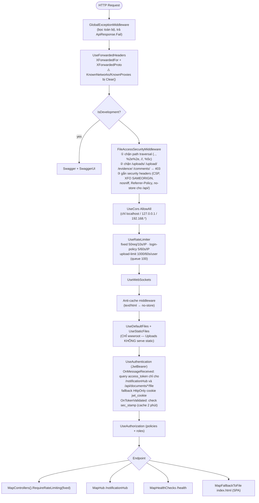

> **Thứ tự đáng lưu ý**: `FileAccessSecurity` đặt **trước** `UseAuthentication` (chủ ý — chặn sớm nhất, không phụ thuộc `[Authorize]`). Hệ quả: log của middleware này luôn thấy `User = anonymous`.

---

## 6. Kiến trúc Bảo mật & Xác thực

### 6.1. Mô hình phòng thủ nhiều lớp

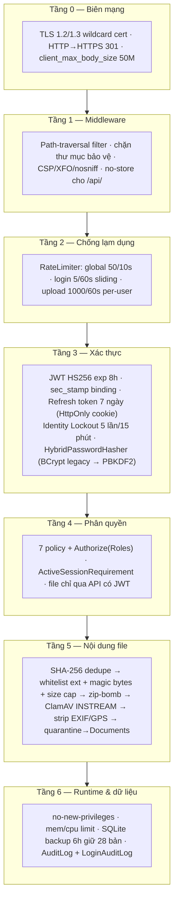

### 6.2. Luồng đăng nhập (chi tiết)

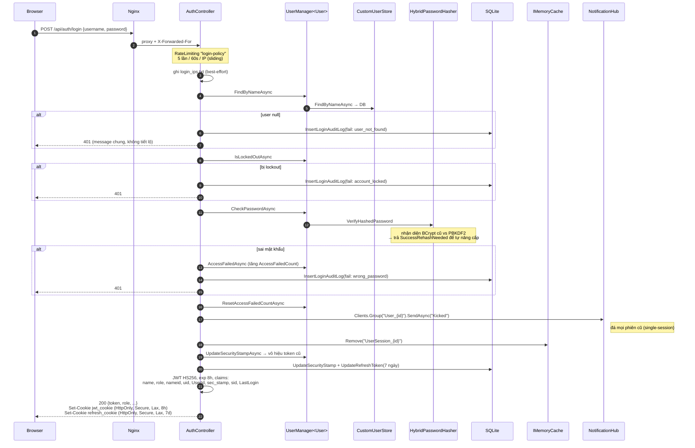

### 6.3. Kiểm tra token mỗi request (`OnTokenValidated`)

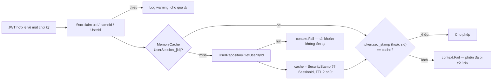

> **Trade-off**: cache 2 phút giảm tải DB nhưng tạo **cửa sổ tối đa 2 phút** mà token vừa bị vô hiệu vẫn dùng được (trừ khi login mới chủ động `cache.Remove`).

### 6.4. Bảo vệ file đính kèm

| Cơ chế | Chi tiết |
|---|---|
| Không serve static | `Uploads/` **không** đăng ký `UseStaticFiles`; middleware chặn mọi `/uploads/*` → 403 |
| Truy cập hợp lệ | `GET /api/documents/{id}/file`, `/{id}/evidence/{index}`, `/comment-attachment`, `/evidence-file` — đều `[Authorize(Roles=...)]` |
| Token qua query string | **Chỉ** cho `/notificationHub` và path kết thúc `/file` (để PDF viewer/iframe hoạt động); các endpoint khác buộc dùng header hoặc cookie |
| UX 401/403 | `OnChallenge`/`OnForbidden`: nếu `Accept: text/html` và path `/api/documents/*/file` → redirect `/?error=unauthorized` thay vì trả 401 thô |
| Tên file | `SanitizeFileName` (chỉ chữ/số/`_`/`-`/space) + prefix `Guid` |

---

## 7. Luồng nghiệp vụ 1 — Upload & xử lý tài liệu (OCR + RAG Index)

### 7.1. Giai đoạn đồng bộ — Upload & kiểm duyệt

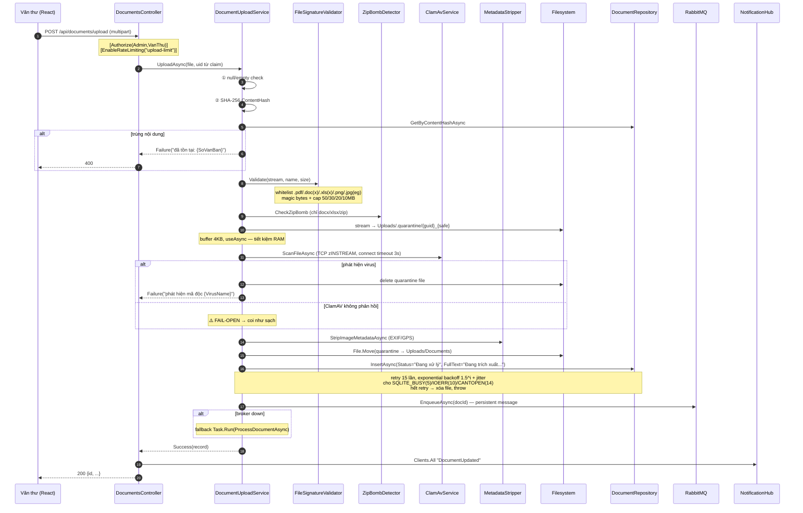

### 7.2. Giai đoạn bất đồng bộ — Two-speed extraction + RAG index

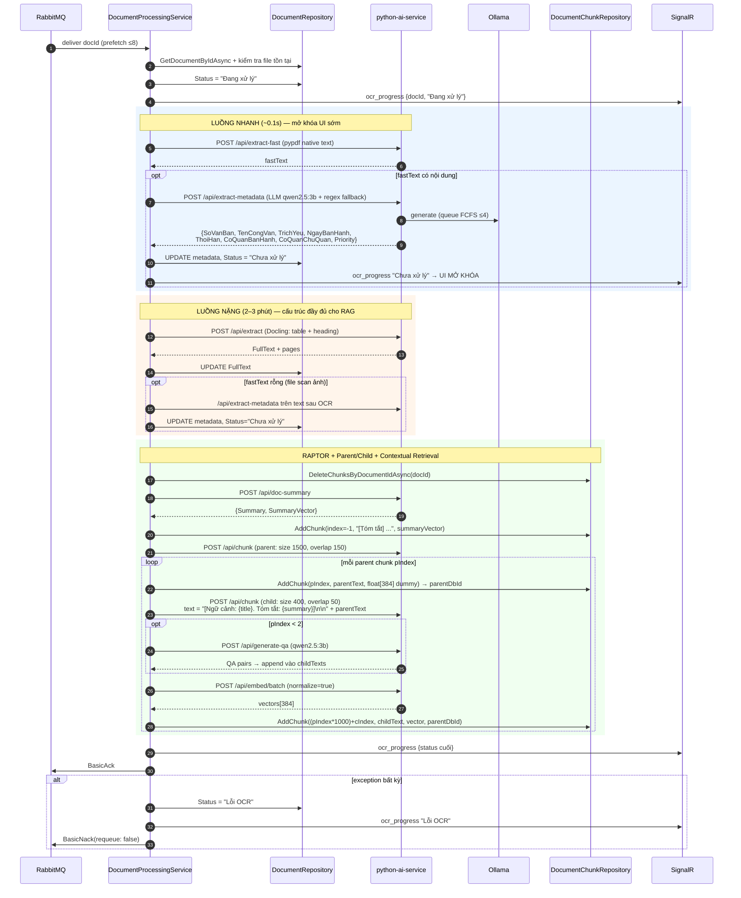

**Nguyên lý thiết kế nổi bật:**

| Kỹ thuật | Cài đặt | Lợi ích |
|---|---|---|
| **Two-speed extraction** | `extract-fast` (pypdf) trước, `extract` (Docling) sau | Người dùng thấy metadata sau ~0.1s thay vì chờ 2–3 phút |
| **Parent/Child chunking** | Parent 1500/150 (không embed thật — vector `float[384]` toàn 0), Child 400/50 (embed thật) | Search chính xác trên child, trả context rộng từ parent |
| **Contextual Retrieval** | Chèn `[Ngữ cảnh: title. Tóm tắt: summary]` vào đầu parent trước khi chunk child | Thay vì gọi LLM cho từng chunk (đắt), chỉ cần 1 lần summary — tiết kiệm ~95% thời gian |
| **RAPTOR macro-chunk** | Summary lưu ở `ChunkIndex = -1`, `ParentChunkId = null` | Trả lời được câu hỏi rộng "tài liệu này nói về gì" |
| **QA-Pair indexing** | Chỉ 2 parent chunk đầu sinh QA pair | Tăng recall cho câu hỏi dạng hỏi-đáp mà không quá tải LLM |

---

## 8. Kiến trúc AI / RAG

### 8.1. Bản đồ thành phần Python AI Service

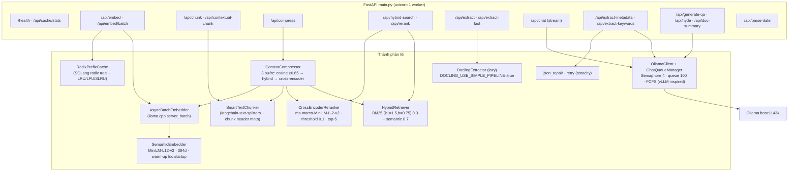

### 8.2. Luồng hội thoại trợ lý AI (agent loop)

```mermaid
sequenceDiagram
    autonumber
    participant FE as AiChatbox (SSE)
    participant CC as ChatController
    participant AS as AiAssistantService
    participant EM as OllamaEmbeddingService
    participant SC as AiSemanticCacheRepository
    participant SR as SemanticRouterService
    participant MEM as UserMemoryRepository
    participant TR as AiToolRegistry
    participant OL as Ollama /api/chat
    participant PY as python /api/compress

    FE->>CC: POST /api/chat/message {message, documentId?}
    CC->>CC: Content-Type: text/event-stream<br/>X-Accel-Buffering: no (tắt buffer Nginx)
    CC->>AS: ProcessChatStreamAsync(userId, message, docId)
    AS-->>FE: "(Đang phân tích yêu cầu...)" — flush header ngay
    AS->>MEM: RecallMemoriesAsync(topK=5, minScore=0.25)<br/>fallback GetRecentMemories(3)

    rect rgb(255,250,230)
    Note over AS: ① Regex fast-path
    AS->>AS: match "tìm/tra cứu ... công văn số (X)"
    opt khớp
        AS->>TR: search_documents_by_condition{keyword}
        AS-->>FE: stream kết quả · return
    end
    end

    rect rgb(230,250,255)
    Note over AS,SC: ② Semantic cache (GPTCache pattern)
    AS->>EM: GenerateEmbeddingAsync(message)
    AS->>SC: GetCachedResponseAsync(vector, sim ≥ 0.85)
    opt cache hit
        AS-->>FE: stream cached · return
    end
    end

    rect rgb(240,240,255)
    Note over AS,SR: ③ Semantic routing (tool hint)
    AS->>SR: RouteQueryAsync(vector) — so với route templates đã cache
    SR-->>AS: "search_documents_by_condition" | null
    AS->>AS: chèn system message gợi ý tool
    end

    opt có documentId
        AS->>PY: POST /api/compress {query, doc.FullText, max_results 5,<br/>similarity_threshold = AppSettings.AiSimilarityThreshold ?? 0.65}
        PY-->>AS: ContextString (fallback: substring 3000 ký tự)
    end

    AS->>AS: build system prompt<br/>persona theo role (Lãnh đạo/Admin → "Sếp"; khác → "Đồng chí")<br/>+ 6 luật chống hallucination + ReAct + inline citation [DOC|id|tên]<br/>+ tag [REMINDER|...] / [STORE_MEMORY|...]
    AS->>AS: history 20 tin nhắn, cắt theo ngân sách 3000 ký tự

    loop N-hop tool chain (hop 0..5)
        AS->>OL: POST /api/chat {model, messages, tools, stream:false}<br/>timeout 300s, retry 1 lần, delay 2s
        alt Ollama lỗi/timeout sau retry
            AS-->>FE: thông điệp degradation lịch sự · return
        end
        alt có tool_calls
            AS-->>FE: "(Đang tra cứu hệ thống...)"
            AS->>TR: ExecuteToolAsync (dedup guard: mỗi tool ≤2 lần)
            TR-->>AS: kết quả → messages[role=tool]
        else có content
            AS->>AS: finalText, break
        end
    end
    Note over AS: hop cuối bỏ "tools" để buộc LLM sinh text

    AS->>AS: đảm bảo có từ thưa gửi ("Dạ báo cáo sếp"/"Chào đồng chí")
    AS-->>FE: stream từng chunk 50 ký tự
    AS->>AS: HandleSpecialTags → StoreMemory / AddReminder
    AS->>SC: StoreCacheAsync (LRU, MaxCacheSize 500)
```

### 8.3. Bộ công cụ Agent (`IAiTool`)

| Tool | Chức năng | Nguồn dữ liệu |
|---|---|---|
| `get_document_stats` | Số liệu tổng quan, đếm theo trạng thái/hạn | `IStatsRepository` |
| `search_documents_by_condition` | Tìm theo số hiệu, trạng thái, khoảng thời hạn | `IDocumentRepository` |
| `search_document_content` | RAG semantic/hybrid trên nội dung | `IDocumentChunkRepository` |
| `web_search` | Tra cứu ngoài | Tavily API |
| `chart_generator` | Sinh dữ liệu biểu đồ cho UI | Stats |

### 8.4. Truy hồi vector — cài đặt trong C#

`DocumentChunkRepository` triển khai vector search **trong process** (không dùng extension vector của SQLite):

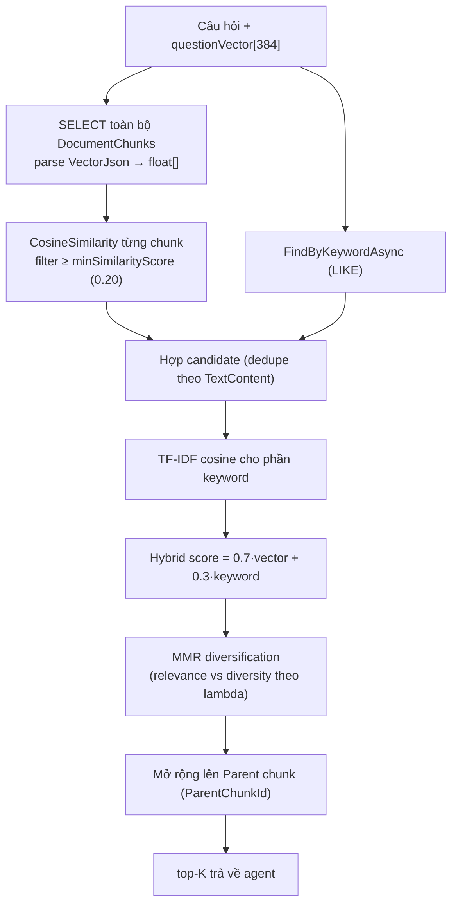

> ⚠️ **Cảnh báo scale**: đây là **full scan + tính toán O(N·384) trong RAM mỗi truy vấn**. Với ~50 nghìn child chunk, mỗi câu hỏi phải load và parse toàn bộ JSON vector. Xem [§17](#17-rủi-ro-kiến-trúc--nợ-kỹ-thuật).

---

## 9. Kiến trúc Thông báo (Real-time & Push)

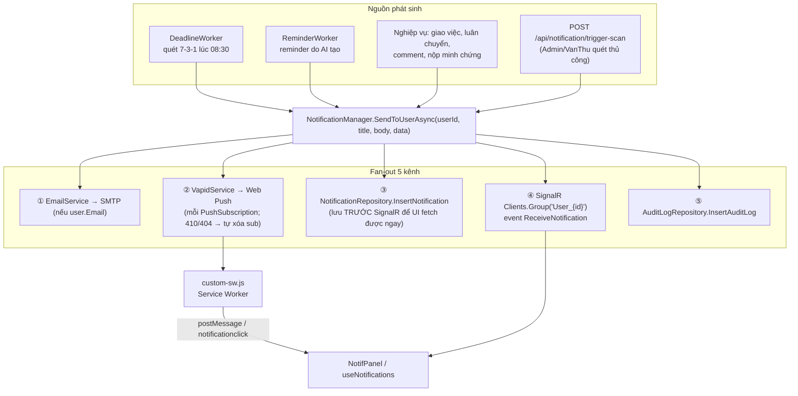

### 9.1. Sự kiện SignalR

| Event | Hướng | Payload | Nơi phát |
|---|---|---|---|
| `ReceiveNotification` | S→C (group) | `{title, body, data}` | `NotificationManager` |
| `ReceiveReminder` | S→C (user) | `{id, content, remindAt}` | `ReminderWorker` |
| `ocr_progress` | S→C (**All**) | `{docId, status}` | `DocumentProcessingService` |
| `DocumentUpdated` | S→C (**All**) | — | `DocumentsController.Upload` |
| `Kicked` | S→C (group) | `string` | `AuthController.Login` (single-session) |

> Hai event broadcast `Clients.All` (`ocr_progress`, `DocumentUpdated`) gửi tới **mọi** client kể cả người không liên quan tài liệu đó — chấp nhận được ở quy mô một cơ quan, nhưng là điểm cần siết nếu multi-tenant.

### 9.2. Thuật toán 7-3-1

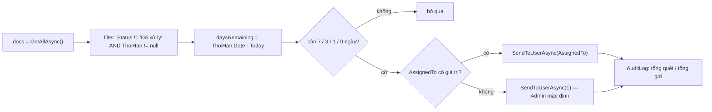

> Lưu ý: worker chỉ thông báo cho `AssignedTo` (một người) — **không** fan-out theo `AssignedUserIds`/`AssignedDepartmentIds` (JSON array). Văn bản giao nhóm sẽ chỉ nhắc 1 người hoặc dồn về Admin id=1.

---

## 10. Mô hình dữ liệu

### 10.1. ERD lõi nghiệp vụ

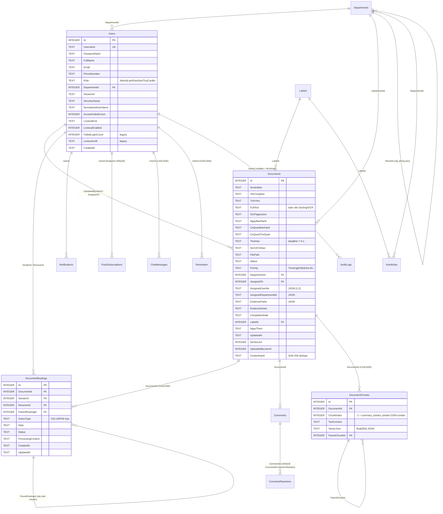

### 10.2. ERD nhóm AI & hệ thống

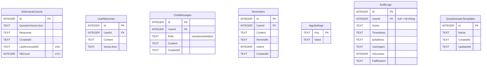

**Cấu hình runtime lưu trong `AppSettings`** (không phải file config):
`Vapid_PublicKey`, `Vapid_PrivateKey`, `Notification_ScanTime` (mặc định `08:30`), `Notification_LastScanDate`, `Document_DeadlineKeywords`, `Document_DeadlineExcludeKeywords`, `AiSimilarityThreshold`.

### 10.3. Chiến lược migration

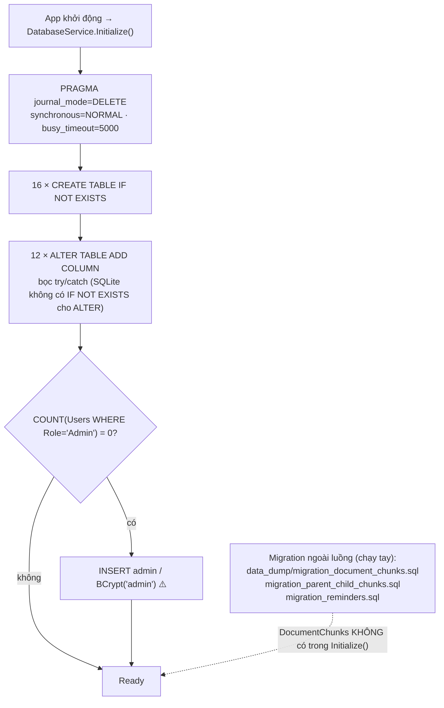

> ⚠️ **Hai rủi ro**: (1) bảng `DocumentChunks` (+ index, `ParentChunkId`) và `UserMemories` **không** nằm trong `Initialize()` — môi trường mới phải chạy SQL tay, nếu quên thì RAG chết âm thầm (`catch` chỉ log warning). (2) admin mặc định `admin/admin` được seed tự động.

---

## 11. Máy trạng thái nghiệp vụ

### 11.1. Trạng thái công văn

```mermaid
stateDiagram-v2
    [*] --> DangXuLy_Upload : Upload thành công (Status="Đang xử lý")
    DangXuLy_Upload --> DangXuLy_OCR : Worker nhận message
    DangXuLy_OCR --> ChuaXuLy : luồng nhanh/nặng trích xuất OK
    DangXuLy_OCR --> LoiOCR : exception → BasicNack
    LoiOCR --> DangXuLy_OCR : POST /{id}/reindex
    ChuaXuLy --> DaRaSoat : bulk-confirm (Admin/VanThu)
    ChuaXuLy --> DangXuLy : assign / routing
    DaRaSoat --> DangXuLy : assign / routing
    DangXuLy --> DaXuLy : submit-evidence (Admin/CanBo)
    DangXuLy --> TuChoi : reject-assignment
    TuChoi --> DangXuLy : giao lại
    DaXuLy --> [*]

    note right of DaXuLy
        CompletionDate được set
        → dùng phân loại
        completed_ontime / completed_overdue
    end note
    note right of ChuaXuLy
        Dashboard tính overdue khi
        ThoiHan < now AND Status != 'Đã xử lý'
    end note
```

### 11.2. Trạng thái luân chuyển (`DocumentRoutings`)

```mermaid
stateDiagram-v2
    [*] --> DangXuLy : POST /api/documents/{id}/routings<br/>(ActionType = Chủ trì | Phối hợp)
    DangXuLy --> HoanThanh : PUT /api/routings/{id}/status
    DangXuLy --> TuChoi : PUT /api/routings/{id}/reject
    TuChoi --> DangXuLy : Sender giao lại (routing mới, ParentRoutingId trỏ về)
    HoanThanh --> [*]
    note right of DangXuLy
        Cây đa cấp qua ParentRoutingId
        → hiển thị bằng DocumentRoutingTree.jsx
    end note
```

---

## 12. Kiến trúc Frontend

### 12.1. Cấu trúc module (feature-based)

```mermaid
graph TB
    MAIN["main.jsx<br/>• Global fetch interceptor (unwrap ApiResponse, auto-refresh 401)<br/>• ErrorBoundary<br/>• Router thủ công theo pathname"]

    subgraph SHELL["shell/"]
        AS["AppShell.jsx (layout, SW message handler, mobile bottom nav)"]
        SB["Sidebar.jsx (8 tab: dashboard, documents, search, reports,<br/>upload, users, my_tasks, settings)"]
        NP["NotifPanel.jsx · UserMenu.jsx"]
    end

    subgraph FEAT["features/"]
        FD["documents/<br/>routes: Dashboard · Documents · DocDetail · UploadPage<br/>MyTasks · Review · Search · MonthlyReport<br/>hooks: useDocumentsList · useDocumentUpload · useReview<br/>useSaveAll · useSearch · useBulkSelect · useDocDetail<br/>api: documentApi.js · context: DocumentUploadContext"]
        FN["notifications/ (useNotifications, NotificationList, NotifAvatar)"]
        FS["schedule/ (PublicSchedule + usePublicSchedule)"]
        FT["tasks/ (useMyTasks, EvidenceModal)"]
        FU["users/ (useUsers, UserModal)"]
    end

    subgraph SHARED["components/ + lib/ + constants/"]
        UIC["ui/ — 24 primitive shadcn (button, dialog, table, sheet, sidebar...)"]
        DASH["dashboard/ — KpiCard · DeadlineBarChart · EventLogCard · DashboardToolbar"]
        CHAT["chat/AiChatbox.jsx (SSE consumer)"]
        LIB["lib/ — signalr.js · push-notifications.js<br/>ReportExportLogic.js (docx + pdf-lib) · utils.js · constants.js"]
        CONST["constants/ — document.js · meeting.js · roles.js"]
    end

    PAGES["pages/ — Login · Users · Settings · PublicSchedule"]

    MAIN --> SHELL & PAGES
    SHELL --> FEAT
    FEAT --> SHARED
    PAGES --> SHARED
```

### 12.2. Cơ chế đặc thù ở tầng client

| Cơ chế | Cài đặt | Ý nghĩa |
|---|---|---|
| **Fetch interceptor** | Ghi đè `window.fetch` — tự bóc `{success, data, errors}` thành `data` phẳng | Component không cần biết envelope `ApiResponse` |
| **Silent refresh** | Gặp 401 (trừ `/login`, `/refresh`) → `POST /api/auth/refresh` bằng HttpOnly cookie → replay request | Người dùng không bị đăng xuất đột ngột trong 7 ngày |
| **Kênh xác thực kép** | `localStorage.auth_token` (header) **+** `jwt_cookie` HttpOnly (iframe PDF) | Cho phép mở PDF bằng `<iframe>`/`window.open` không nhét token vào URL |
| **PWA** | `vite-plugin-pwa` `autoUpdate`, `importScripts('/custom-sw.js')`, `navigateFallbackDenylist: /^\/api/` | Cài như app, nhận Web Push khi đóng tab |
| **Build vào backend** | `outDir: ../wwwroot`, `emptyOutDir: false`, `assetsDir: vite-assets`, `prebuild` dọn asset cũ | Giữ chung với asset legacy trong `wwwroot` |
| **Dev proxy** | `/api`, `/notificationHub` (ws), `/Uploads`, `/assets`, `/partials`, `/sw.js` → `localhost:59607` | Hot-reload UI trong khi backend chạy Docker |

---

## 13. Ma trận phân quyền (RBAC)

### 13.1. Policy tập trung (`AppPolicies`)

| Policy | Role được phép | Ràng buộc thêm |
|---|---|---|
| `IsAuthenticated` | mọi role đã đăng nhập | — |
| `CanViewDocuments` | Admin, VanThu, LanhDao, CanBo | — |
| `CanUploadDocuments` | Admin, VanThu | — |
| `CanDeleteDocuments` | Admin | — |
| `CanViewFiles` | Admin, VanThu, LanhDao, CanBo | **`ActiveSessionRequirement`** |
| `CanSubmitEvidence` | Admin, CanBo | — |
| `CanManageUsers` | Admin | — |
| `RequireAdminOrLanhDao` | Admin, LanhDao, VanThu, CanBo | *(đang nới lỏng để test — tên gây nhầm lẫn)* |

> `FallbackPolicy` **cố ý không** đặt, nếu không sẽ chặn cả `index.html` của SPA. `DefaultPolicy = RequireAuthenticatedUser`.

### 13.2. Ma trận chức năng × vai trò (theo `[Authorize(Roles=...)]` thực tế trong code)

| Chức năng | Admin | Lãnh đạo | Văn thư | Cán bộ | Khách |
|---|:--:|:--:|:--:|:--:|:--:|
| Xem danh sách / chi tiết công văn | ✅ | ✅ | ✅ | ✅ | ❌ |
| Upload công văn | ✅ | ❌ | ✅ | ❌ | ❌ |
| Tạo công văn thủ công / bulk-confirm / bulk-delete | ✅ | ❌ | ✅ | ❌ | ❌ |
| Sửa công văn (`PUT /{id}`) | ✅ | ✅ | ✅ | ✅ | ❌ |
| Xóa 1 công văn (`DELETE /{id}`) | ✅ | ❌ | ❌ | ❌ | ❌ |
| Reindex RAG (`POST /{id}/reindex`) | ✅ | ✅ | ✅ | ✅ | ❌ |
| Cập nhật status / assign / reject-assignment | ✅ | ✅ | ✅ | ✅ | ❌ |
| Nộp minh chứng (`submit-evidence`) | ✅ | ❌ | ❌ | ✅ | ❌ |
| Tải file PDF / minh chứng / attachment | ✅ | ✅ | ✅ | ✅ | ❌ |
| Bình luận / reaction / xóa comment | ✅ | ✅ | ✅ | ✅ | ❌ |
| Luân chuyển (`routings`) | ✅ | ✅ | ✅ | ✅ | ❌ |
| Dashboard / activities / deadline-series / monthly-report | ✅ | ✅ | ✅ | ✅ | ❌ |
| Đọc & ghi cấu hình (`/api/stats/settings`) | ✅ | ❌ | ✅ | ❌ | ❌ |
| Quản lý user (CRUD) | ✅ | ❌ | ❌ | ❌ | ❌ |
| Xem danh sách user (chọn người giao việc) | ✅ | ✅ | ✅ | ✅ | ❌ |
| Phòng ban: đọc | ✅ | ✅ | ✅ | ✅ | ❌ |
| Phòng ban / Labels / AutoRules: ghi & xóa | ✅ | ❌ | ❌ | ❌ | ❌ |
| Audit logs (xem / xóa) | ✅ | ❌ | ❌ | ❌ | ❌ |
| Backup export DB | ✅ | ❌ | ❌ | ❌ | ❌ |
| Quét thời hạn thủ công (`trigger-scan`) | ✅ | ❌ | ✅ | ❌ | ❌ |
| Trợ lý AI (chat) | ✅ | ✅ | ✅ | ✅ | ❌ |
| Lịch công tác công khai (`public-schedule`) | ✅ | ✅ | ✅ | ✅ | ✅ |
| VAPID public key | ✅ | ✅ | ✅ | ✅ | ✅ |

> ⚠️ **Khoảng trống**: phân quyền hiện là **role-based thuần**, chưa có **row-level security**. `GET /api/documents` gọi `GetPagedAsync(...)` **không nhận `userId`/`departmentId`** → mọi role (kể cả `CanBo`) đều xem được toàn bộ công văn của mọi phòng ban. Xem [§17](#17-rủi-ro-kiến-trúc--nợ-kỹ-thuật) R-02.

---

## 14. Danh mục API

### 14.1. Backend .NET (prefix `/api`)

| Controller | Endpoint | Method | Quyền |
|---|---|---|---|
| **Auth** | `/auth/login` | POST | Anonymous + rate limit `login-policy` |
| | `/auth/refresh` | POST | cookie `refresh_cookie` |
| | `/auth/logout` | POST | — |
| | `/auth/change-password` | POST | `[Authorize]` |
| **Documents** | `/documents` | GET | 4 role · paging, search, status, sort, fromDate/toDate, addFromDate/addToDate |
| | `/documents/statuses` | GET | 4 role |
| | `/documents/{id}` | GET | 4 role |
| | `/documents/upload` | POST | Admin, VanThu · `upload-limit` |
| | `/documents` | POST | Admin, VanThu |
| | `/documents/bulk-confirm` | POST | Admin, VanThu |
| | `/documents/bulk-delete` | DELETE | Admin, VanThu |
| | `/documents/{id}` | PUT / DELETE | 4 role / Admin |
| | `/documents/{id}/reindex` | POST | authenticated |
| | `/documents/{id}/status` | PUT | authenticated |
| | `/documents/{id}/reject-assignment` | PUT | authenticated |
| | `/documents/{id}/assign` | POST | authenticated |
| | `/documents/{id}/submit-evidence` | POST | Admin, CanBo |
| | `/documents/my-tasks` | GET | 4 role |
| | `/documents/{id}/file` | GET | 4 role (token qua header/cookie/query) |
| | `/documents/{id}/evidence/{index}` | GET | 4 role |
| | `/documents/evidence-file`, `/documents/comment-attachment` | GET | 4 role |
| | `/documents/{id}/comments` | GET / POST | 4 role |
| | `/documents/{docId}/comments/{commentId}` | DELETE | 4 role |
| | `/documents/{docId}/comments/{commentId}/react` | POST | 4 role |
| | `/documents/{id}/references` | GET | authenticated (`AiReferenceService`) |
| | `/documents/public-schedule` | GET | **AllowAnonymous** |
| | `/documents/public-file` | GET | `[Authorize]` |
| **Routings** | `/documents/{documentId}/routings` | GET / POST | authenticated |
| | `/routings/{id}/reject`, `/routings/{id}/status` | PUT | authenticated |
| **Stats** | `/stats` | GET | 4 role (MemoryCache) |
| | `/stats/activities`, `/stats/deadline-series`, `/stats/monthly-report` | GET | 4 role |
| | `/stats/invalidate-cache` | POST | 4 role |
| | `/stats/settings` | GET / POST | Admin, VanThu |
| **Users** | `/users` | GET | 4 role (đã lọc bỏ `PasswordHash`) |
| | `/users/{id}` | GET | Admin, VanThu |
| | `/users`, `/users/{id}` | POST / PUT / DELETE | Admin |
| **Admin** | `/admin/departments` | GET (4 role) / POST / PUT / DELETE (Admin) | |
| | `/admin/labels`, `/admin/rules` | GET/POST/DELETE | Admin |
| | `/admin/audit-logs`, `/admin/clear-audit-logs` | GET / POST | Admin |
| **Notification** | `/notification` | GET | authenticated |
| | `/notification/vapid-public-key` | GET | **AllowAnonymous** |
| | `/notification/subscribe`, `/unsubscribe`, `/test` | POST | authenticated |
| | `/notification/mark-read/{id}`, `/mark-all-read` | POST | authenticated |
| | `/notification/trigger-scan` | POST | Admin, VanThu |
| **Chat** | `/chat/history` | GET / DELETE | authenticated |
| | `/chat/message` | POST | authenticated · **SSE** `text/event-stream` |
| **Backup** | `/backup/export` | GET | Admin |
| **Hạ tầng** | `/health` | GET | Anonymous (Docker healthcheck) |
| | `/notificationHub` | WS | JWT qua query `access_token` |

### 14.2. Python AI Service (`:8001`, chỉ nội bộ Docker)

| Endpoint | Method | Chức năng |
|---|---|---|
| `/health` | GET | status + model + radix cache + chat queue depth |
| `/api/cache/stats`, `/api/cache/clear` | GET / DELETE | quản trị RadixTree cache |
| `/api/embed`, `/api/embed/batch` | POST | embed 1/nhiều text, L2 normalize |
| `/api/chunk`, `/api/contextual-chunk` | POST | chunking (có metadata header) |
| `/api/compress` | POST | RAG 3 bước: cosine → hybrid → cross-encoder |
| `/api/hybrid-search`, `/api/rerank` | POST | BM25+semantic, CrossEncoder rerank |
| `/api/extract`, `/api/extract-fast` | POST | Docling full parse / pypdf native text |
| `/api/extract-metadata`, `/api/extract-keywords` | POST | bóc tách trường công văn (LLM + `fallback_extract_metadata` regex) |
| `/api/doc-summary`, `/api/generate-qa`, `/api/hyde` | POST | tăng cường RAG |
| `/api/parse-date` | POST | parse ngày tiếng Việt tự nhiên |
| `/api/chat` | POST | stream chat qua Ollama (queue FCFS) |

> ⚠️ Service này **không có xác thực** — an toàn chỉ nhờ `expose` (không map host port) và biên network Docker.

---

## 15. CI/CD & Quality Gates

### 15.1. Quality gates lúc commit (git hooks)

```mermaid
flowchart TB
    DEV["Developer / AI agent"] --> C["git commit"]
    C --> H1["pre-commit"]
    H1 --> G1{"① COMMIT_LOG.md<br/>đã cập nhật?"}
    G1 -->|không| X1["❌ BLOCK"]
    G1 --> G2{"② Secrets / hardcoded password?"}
    G2 -->|có| X2["❌ BLOCK"]
    G2 --> G3{"③ ESLint (no ==, no var,<br/>no eval, no console, hooks rules)"}
    G3 -->|fail| X3["❌ BLOCK"]
    G3 --> G4{"④ Prettier"}
    G4 -->|fail| X4["❌ BLOCK"]
    G4 --> G5{"⑤ dotnet format"}
    G5 -->|fail| X5["❌ BLOCK"]
    G5 --> H2["commit-msg"]
    H2 --> G6{"Conventional Commits<br/>feat/fix/docs/style/refactor/perf/test/chore"}
    G6 -->|fail| X6["❌ BLOCK"]
    G6 --> OK["✅ COMMIT"]
    OK --> H3["post-commit / pre-push / post-merge / post-checkout"]
```

### 15.2. Deploy pipeline

```mermaid
sequenceDiagram
    autonumber
    participant D as Dev
    participant GH as GitHub Actions
    participant SRV as VNPT Server
    participant DK as Docker

    D->>GH: push → branch develop
    GH->>GH: checkout fetch-depth 2
    GH->>SRV: appleboy/ssh-action (host/user/pass từ Secrets)
    SRV->>SRV: git fetch origin develop
    SRV->>SRV: PYTHON_CHANGED = git diff HEAD origin/develop -- python-ai-service/ | wc -l
    SRV->>SRV: git reset --hard origin/develop
    SRV->>DK: docker compose build official-doc-backend
    SRV->>DK: docker rm -f doc-coordination-system; compose up -d
    alt PYTHON_CHANGED > 0
        SRV->>DK: build + recreate python-ai-service (~5–10 phút)
    else
        SRV->>DK: docker restart python-ai-service (nhanh)
    end
    SRV->>DK: docker exec nginx-proxy nginx -s reload (|| restart)
    SRV->>GH: docker ps status
```

**Script deploy thủ công** (dùng khi cần kiểm soát nhiều hơn):

| Script | Vai trò |
|---|---|
| `deploy_to_vnpt.sh` | prune nhẹ → git reset → **backup `documents.db`** → so `sha256sum requirements.txt` với `/tmp/.python_ai_req_hash` để quyết định build Python → build backend → `compose up -d --no-deps` |
| `deploy_gateway.sh` | scp `gateway/*` → `/root/vp-gateway`, copy cert từ thư mục cũ, xóa `nginx-proxy` cũ, `compose up -d --build` |
| `check_git.sh`, `check_logs.sh`, `run_*.sh`, `tunnel.sh` | tiện ích vận hành/chẩn đoán |

### 15.3. Kiểm thử

| Tầng | Vị trí | Nội dung |
|---|---|---|
| Integration (.NET) | `ToolCalendar.Tests/` | `IntegrationTestBase` (WebApplicationFactory), `BusinessFlowTests` (golden path: login → upload PDF sinh động → OCR → assign → evidence), `AuthPasswordHashTests`, `Helpers/AutomationDocHelper` sinh PDF ảnh giả lập |
| Script Python (ad-hoc) | root repo | `test_ai.py`, `test_api_chat.py`, `test_deadline.py`, `test_extract_metadata.py`, `test_fast_extract.py`, `test_regex.py`, `test_pdf*.py`, `remote_test.py` |
| OCR fixtures | `tests/assets`, `tests/ocr_test`, `tests/test_results` | tài liệu mẫu + kết quả đối chứng |

> Bộ test Python nằm rải ở thư mục gốc và **không** được CI chạy; CI hiện chỉ build + deploy, **không có bước `dotnet test`**.

---

## 16. Thuộc tính phi chức năng (NFR)

### 16.1. Ngân sách tài nguyên

| Container | RAM | CPU | Healthcheck | Restart |
|---|---|---|---|---|
| `python-ai-service` | 2560m (swap = mem) | 1.5 | `curl :8001/health` 30s/10s/3, start 40s | unless-stopped |
| `official-doc-backend` | 512m | 1.0 | `curl :5000/health` 30s/10s/3, start 40s | unless-stopped |
| `rabbitmq` | 256m | 0.5 | `rabbitmq-diagnostics ping` | unless-stopped |
| `clamav` | 1536m | 1.0 | — | unless-stopped |
| `uptime-kuma` | 256m | 0.5 | — | unless-stopped |
| `nginx-proxy` | 128m | 0.5 | — | unless-stopped |
| **Tổng** | **≈5.2 GB** | **≈5.0 vCPU** | | + Ollama trên host (ngoài quota) |

Log: mọi service dùng `json-file`, `max-size 10m`, `max-file 3` → trần ~30MB/service.

### 16.2. Giới hạn & timeout

| Hạng mục | Giá trị |
|---|---|
| Rate limit toàn cục | 50 req / 10s / IP (fixed window, queue 0) |
| Rate limit login | 5 req / 60s / IP (sliding, 6 segment) |
| Rate limit upload | 1000 req / 60s / user (queue 100, OldestFirst) |
| JWT access token | 8 giờ |
| Refresh token | 7 ngày |
| Identity lockout | 5 lần sai → khóa 15 phút |
| Cache SecurityStamp | 2 phút (MemoryCache) |
| Upload tối đa | Nginx 50M; theo loại: PDF 50MB, DOC(X) 30MB, XLS(X) 20MB, ảnh 10MB |
| HttpClient → Python | 10 phút |
| Ollama chat (C#) | 300s + 1 retry (delay 2s) |
| Python chat | 180s (connect 3s) |
| Nginx proxy | 300s (thường), 3600s (`/notificationHub`) |
| RabbitMQ prefetch | 8 file song song |
| Ollama đồng thời (Python) | Semaphore 4, queue 100 |
| Agent tool chain | ≤5 hop, mỗi tool ≤2 lần |
| Semantic cache | ngưỡng 0.85, tối đa 500 bản ghi (LRU + HitCount) |
| RAG thresholds | cosine ≥0.20 (search) / ≥0.65 (compress); rerank ≥0.1 top-5; hybrid 0.7 vector + 0.3 keyword |
| Backup | mỗi 6h, giữ 28 bản |
| Dọn AuditLog | > 30 ngày, chạy sau lần quét 08:30 |

### 16.3. Chiến lược caching (nhiều tầng)

```mermaid
graph LR
    L1["① Browser<br/>PWA precache (Workbox)<br/>no-store cho HTML & /api/"]
    L2["② IMemoryCache (.NET)<br/>dashboard stats · UserSession_{id} 2 phút"]
    L3["③ AiSemanticCache (SQLite)<br/>cosine ≥0.85 · LRU 500"]
    L4["④ SemanticRouter route embeddings<br/>static in-process cache"]
    L5["⑤ RadixPrefixCache (Python)<br/>prefix tree · LRU/LFU/SLRU"]
    L6["⑥ Docker layer cache<br/>+ hash requirements.txt khi deploy"]
    L1-->L2-->L3-->L4-->L5-->L6
```

### 16.4. Khả năng phục hồi (resilience)

| Điểm lỗi | Hành vi | Đánh giá |
|---|---|---|
| RabbitMQ down | `AutomaticRecoveryEnabled`, retry 10s; publish lỗi → fallback `Task.Run` in-process | ✅ tốt (nhưng mất tính bền message ở fallback) |
| Python AI down | `catch` từng bước → `Status = "Lỗi OCR"`, có `/reindex` để chạy lại | ✅ |
| Ollama down/timeout | retry 1 lần → trả thông điệp "hệ thống quá tải" lịch sự | ✅ graceful degradation |
| ClamAV down | `ServiceUnavailable` → **fail-open**, cho file qua | ⚠️ rủi ro có ý thức |
| SQLite BUSY | retry 15 lần, backoff 1.5^i + jitter (upload); `busy_timeout=5000` | ✅ |
| Compress API lỗi | fallback substring 3000 ký tự | ✅ |
| Frontend crash | `ErrorBoundary` hiển thị thông báo thay vì trắng trang | ✅ |
| Token hết hạn | silent refresh qua cookie, replay request | ✅ |

---

## 17. Rủi ro kiến trúc & nợ kỹ thuật

> Xếp theo mức độ ưu tiên xử lý. Mức: 🔴 cao · 🟠 trung bình · 🟡 thấp.

| ID | Mức | Hạng mục | Chi tiết & vị trí | Ảnh hưởng | Khuyến nghị |
|---|:--:|---|---|---|---|
| **R-01** | 🔴 | **Semantic cache dùng chung giữa các user** | `AiSemanticCache` **không có cột `UserId`**; `AiAssistantService` lưu/đọc cache chỉ theo vector câu hỏi (`AiSemanticCacheRepository.cs`) | Câu trả lời chứa dữ liệu công văn của user A có thể được trả lại cho user B khi câu hỏi tương tự ≥0.85 → **rò rỉ thông tin xuyên vai trò** | Thêm `UserId` (hoặc `Role`+`DepartmentId`) vào khóa cache; hoặc tắt cache cho câu trả lời chứa dữ liệu tài liệu |
| **R-02** | 🔴 | **Thiếu row-level security** | `DocumentsController.GetDocuments` → `GetPagedAsync(page,size,search,status,sort,dates)` không truyền `userId`/`departmentId` | `CanBo` xem được toàn bộ công văn mọi phòng ban, kể cả văn bản mật của lãnh đạo | Thêm tham số scope vào repository; lọc theo `DepartmentId`/`AssignedUserIds` cho role `CanBo`/`LanhDao` |
| **R-03** | 🔴 | **Cổng quản trị mở ra Internet** | `docker-compose.yml`: `15672` (RabbitMQ management), `3001` (Uptime Kuma), `59607` (backend bypass TLS) map thẳng ra host | Bề mặt tấn công lớn; backend truy cập trực tiếp bỏ qua TLS và toàn bộ header bảo mật của Nginx | Bỏ `ports` của 15672/3001 (dùng `expose` + reverse proxy có auth); ràng buộc `127.0.0.1:59607:5000` |
| **R-04** | 🔴 | **Vector search full-scan trong RAM** | `DocumentChunkRepository.FindSimilarChunksAsync/FindHybridChunksAsync` — `SELECT` toàn bộ chunk, parse `VectorJson`, tính cosine bằng C# | O(N) mỗi truy vấn; với ~50k chunk sẽ tốn hàng trăm MB + vài giây/câu hỏi, và backend chỉ có 512MB RAM | Chuyển sang `sqlite-vec`/`FAISS`/Qdrant; hoặc lưu vector dạng BLOB `float32` + tiền lọc theo `DocumentId` |
| **R-05** | 🟠 | **DDL không đồng bộ với code** | `DocumentChunks`, `UserMemories` **không** có trong `DatabaseService.Initialize()`; chỉ tồn tại trong `data_dump/migration_*.sql` chạy tay | Môi trường mới: RAG và long-term memory chết âm thầm (mọi lỗi đều bị `catch` + log warning) | Đưa toàn bộ DDL vào `Initialize()` hoặc dùng một migration runner có version |
| **R-06** | 🟠 | **Tin tưởng mọi proxy** | `Program.cs`: `KnownNetworks.Clear()` + `KnownProxies.Clear()` | Client truy cập trực tiếp `:59607` có thể giả mạo `X-Forwarded-For` → làm sai audit log IP và **lách rate limit theo IP** | Khai báo đúng subnet Docker bridge thay vì clear |
| **R-07** | 🟠 | **ClamAV fail-open** | `DocumentUploadService`: `catch → ClamAvScanResult.ServiceUnavailable` → tiếp tục lưu file | Khi ClamAV chết (OOM 1.5GB), mọi file vào hệ thống không được quét | Cho cấu hình `ClamAv:FailMode = open|closed`; production nên fail-closed + alert |
| **R-08** | 🟠 | **Admin mặc định `admin/admin`** | `DatabaseService.Initialize()` seed `BCrypt.HashPassword("admin")` khi chưa có Admin | Nếu triển khai mà không đổi ngay → chiếm quyền hệ thống | Sinh mật khẩu ngẫu nhiên in ra log lần đầu, và bắt buộc đổi ở lần đăng nhập đầu |
| **R-09** | 🟠 | **JWT key dùng `Encoding.ASCII`** | `Program.cs` và `AuthController`: `Encoding.ASCII.GetBytes(jwtSecret)` | Key sinh bởi `openssl rand -base64 64` là ASCII nên hiện tại vô hại, nhưng ký tự non-ASCII sẽ bị biến thành `?` → **giảm entropy âm thầm** | Dùng `Encoding.UTF8` |
| **R-10** | 🟠 | **Python AI service không xác thực** | FastAPI không có API key/mTLS; chỉ dựa vào `expose` | Bất kỳ container nào trong `tool-calendar-net` đều gọi được endpoint LLM/embedding | Thêm shared secret header + kiểm tra ở middleware FastAPI |
| **R-11** | 🟡 | **SQLite `journal_mode=DELETE`** | Chọn có ý thức vì "WAL lỗi I/O trên Docker Desktop Windows" | Mất lợi ích đọc-ghi đồng thời của WAL → nhiều `SQLITE_BUSY` (đã phải retry 15 lần khi upload) | Bật WAL trên Linux production (điều kiện theo môi trường) |
| **R-12** | 🟡 | **Ghi file `login_ips.txt` mỗi lần login** | `AuthController.Login` `File.AppendAllText` vào `Directory.GetCurrentDirectory()` | Trùng lặp với `LoginAuditLog`, file phình vô hạn, không rotate, I/O đồng bộ trên hot path | Bỏ, dùng `AuditLogRepository` (đã có `IpAddress`, `UserAgent`) |
| **R-13** | 🟡 | **Broadcast `Clients.All`** | `ocr_progress`, `DocumentUpdated` | Mọi client nhận event của tài liệu không liên quan | Gửi theo group `User_{id}` / `Dept_{id}` |
| **R-14** | 🟡 | **`ReminderWorker` gửi sai kênh** | `Clients.User(userId)` trong khi Hub map group `User_{id}`, không đăng ký `IUserIdProvider` custom | Nhắc nhở AI có thể không tới client | Đổi sang `Clients.Group($"User_{id}")` |
| **R-15** | 🟡 | **Tên policy sai nghĩa** | `RequireAdminOrLanhDao` lại cho phép cả `VanThu` + `CanBo` ("để test") | Đọc code dễ tưởng đã siết quyền | Đổi tên hoặc siết lại đúng ý định |
| **R-16** | 🟡 | **CORS policy tên `AllowAll`** | Thực chất chỉ cho `localhost`/`127.0.0.1`/`192.168.*` | Tên gây hiểu sai; đồng thời domain production **không** nằm trong whitelist (hiện chạy same-origin nên không lỗi) | Đổi tên `AllowLocalAndLan`, thêm domain production nếu cần cross-origin |
| **R-17** | 🟡 | **Thiếu DLQ cho hàng đợi OCR** | `BasicNack(requeue: false)` khi lỗi | Message lỗi mất hẳn, chỉ còn `Status = "Lỗi OCR"` trong DB để lần vết | Khai báo dead-letter exchange + endpoint replay |
| **R-18** | 🟡 | **Không có `dotnet test` trong CI** | `.github/workflows/deploy.yml` chỉ build + deploy | Test tích hợp không chặn được regression | Thêm job `test` trước `deploy` |
| **R-19** | 🟡 | **Deploy dùng SSH password** | `appleboy/ssh-action` với `VNPT_PASS`; script local dùng `sshpass` | Password dễ rò hơn key; không rotate được dễ dàng | Chuyển sang SSH key/deploy key |
| **R-20** | 🟡 | **`COMMIT_LOG.md` 350KB & bắt buộc sửa mỗi commit** | Quality gate #1 | File phình dần, mọi commit đều chạm 1 file → xung đột merge thường xuyên | Chia theo tháng hoặc sinh tự động từ `git log` |
| **R-21** | 🟡 | **Đường dẫn `NotificationPayload.Icon = "/assets/logo.png"`** | Trong repo chỉ có `logo_campha.jpg` | Icon push có thể 404 | Đối chiếu asset thực tế |
| **R-22** | 🟡 | **Code chết / tính năng chưa đấu nối** | `MeetingRepository`, `MeetingNote/Proceeding/Conclusion`, `RoomRepository`, `Questionnaire*` có repository + model nhưng **không** đăng ký DI trong `Program.cs`, không có controller | Nhiễu khi đọc code, tăng chi phí bảo trì | Tách nhánh feature hoặc xóa; ghi rõ trạng thái "sắp làm" |

---

## 18. Khuyến nghị lộ trình cải tiến

```mermaid
graph LR
    subgraph S1["Sprint 1 — Bịt lỗ bảo mật (1–2 tuần)"]
        A1["R-01 scope semantic cache theo user"]
        A2["R-02 row-level filter theo phòng ban"]
        A3["R-03 đóng port 15672/3001, bind 127.0.0.1 cho 59607"]
        A4["R-06 KnownProxies đúng subnet · R-09 UTF8 key"]
        A5["R-08 bỏ admin/admin"]
    end
    subgraph S2["Sprint 2 — Ổn định dữ liệu (2–3 tuần)"]
        B1["R-05 hợp nhất toàn bộ DDL vào migration có version"]
        B2["R-11 bật WAL trên Linux"]
        B3["R-17 DLQ + endpoint replay OCR"]
        B4["R-18 thêm dotnet test vào CI"]
    end
    subgraph S3["Sprint 3 — Hiệu năng RAG (3–4 tuần)"]
        C1["R-04 vector store thật (sqlite-vec / Qdrant)"]
        C2["Vector dạng BLOB float32 thay JSON"]
        C3["Prefilter theo DocumentId/thời gian trước khi tính cosine"]
    end
    subgraph S4["Sprint 4 — Vận hành & dọn dẹp"]
        D1["R-07 ClamAV fail-closed + alert"]
        D2["R-13/R-14 chuẩn hóa kênh SignalR"]
        D3["R-22 dọn code chết Meeting/Questionnaire"]
        D4["R-19 SSH key · R-20 chia COMMIT_LOG"]
        D5["Metrics: Prometheus + OpenTelemetry"]
    end
    S1 --> S2 --> S3 --> S4
```

### 18.1. Ba việc nên làm trước tiên

1. **R-01 (rò rỉ dữ liệu qua semantic cache)** — chỉ cần thêm `UserId` vào bảng + điều kiện `WHERE`, chi phí thấp nhưng bịt một lỗ bảo mật dữ liệu thực sự.
2. **R-03 (cổng quản trị mở)** — sửa 3 dòng trong `docker-compose.yml`, giảm ngay bề mặt tấn công.
3. **R-04/R-05 (RAG)** — hạ tầng vector hiện tại sẽ chạm trần khi kho tài liệu tăng; càng sớm chuyển càng ít phải viết lại.

---

## 19. Phụ lục

### 19.1. Biến môi trường

| Biến | Bắt buộc | Ghi chú |
|---|:--:|---|
| `JWT_SECRET` | ✅ | **≥32 ký tự, app từ chối khởi động nếu thiếu/ngắn**; `openssl rand -base64 64` |
| `PUBLIC_ID_SECRET` | ✅ | `openssl rand -base64 48` |
| `RABBITMQ_USER` / `RABBITMQ_PASS` | ✅ | không dùng `guest/guest` ở production |
| `VAPID_SUBJECT` | ✅ | `mailto:...` theo spec VAPID |
| `VAPID_PUBLIC_KEY` / `VAPID_PRIVATE_KEY` | ⬜ | để trống → `VapidService` tự sinh và lưu vào `AppSettings` |
| `GEMINI_API_KEY`, `TAVILY_API_KEY` | ⬜ | tool web search |
| `DB_PATH` | ✅ (Docker) | `/app/data/documents.db`; nếu thiếu → `%AppData%/ToolCalendar/documents.db` |
| `ASPNETCORE_ENVIRONMENT` | ✅ | `Production` (Swagger chỉ bật ở Development) |
| `TZ` | ✅ | `Asia/Ho_Chi_Minh` (code còn dùng `DateTime.UtcNow.AddHours(7)` ở vài chỗ) |
| `PythonAiServiceUrl` | ⬜ | mặc định `http://python-ai-service:8001` |
| `Ollama__ChatUrl` | ⬜ | `http://host.docker.internal:11434/api/chat` |
| `ClamAv__Host` / `ClamAv__Port` | ⬜ | `clamav` / `3310` |
| `OcrSettings__*` | ⬜ | `RenderDpi=400`, `MaxParallelPages=2`, `MaxPagesToScan=7`, `EnableOsd`, `EnableDeskew` |
| `DOCLING_USE_SIMPLE_PIPELINE` | ⬜ | `true` — giảm RAM cho Docling |

### 19.2. Bản đồ thư mục

```
Tool-Calendar/
├── ToolCalendar.Api/              # Host ASP.NET Core (Presentation)
│   ├── Controllers/               #   9 controller (Documents/ có subfolder)
│   ├── Middleware/                #   GlobalException, FileAccessSecurity
│   ├── Policies/                  #   AppPolicies + ActiveSessionRequirement
│   ├── Security/                  #   CustomUserStore, HybridPasswordHasher
│   ├── Services/                  #   ReminderWorker
│   ├── ClientApp/                 #   React 19 + Vite (build → ../wwwroot)
│   ├── wwwroot/                   #   Static output + asset legacy
│   ├── Uploads/                   #   Documents/ · .quarantine/ · Evidence (KHÔNG serve static)
│   └── Program.cs                 #   DI, JWT, rate limit, pipeline (418 dòng)
├── ToolCalendar.Core/             # Domain + Data + Services
│   ├── Data/{Interfaces,Repositories}, DatabaseService.cs
│   ├── Services/{AiTools, Security}, *.cs
│   ├── Models/, Hubs/, tessdata/
├── ToolCalendar.Tests/            # xUnit + FluentAssertions (integration)
├── python-ai-service/             # FastAPI: rag/ llm_provider/ embeddings/ utils/
├── gateway/                       # Nginx compose độc lập + conf.d + certs
├── data_dump/                     # documents.db + migration_*.sql + backfill_vectors.py
├── docs/                          # legacy/ (PRD, handover, backlog) + ARCHITECTURE.md
├── tests/                         # assets OCR + kết quả đối chứng
├── .githooks/                     # 6 hook (quality gates)
├── .github/workflows/deploy.yml   # CI/CD
├── docker-compose.yml             # 5 service ứng dụng
├── Dockerfile                     # 5 stage
├── SYSTEM_FEATURES.md             # "bộ não" nghiệp vụ cho AI/dev
├── CODE_QUALITY.md                # quy tắc commit & 5 chốt chặn
└── COMMIT_LOG.md                  # lịch sử thay đổi (bắt buộc cập nhật, ~350KB)
```

### 19.3. Nguồn tham chiếu kỹ thuật trong code

Codebase ghi rõ nguồn cảm hứng cho từng kỹ thuật AI — hữu ích khi cần đọc sâu:

| Kỹ thuật trong repo | Nguồn |
|---|---|
| `AsyncBatchEmbedder`, L2 normalize | llama.cpp (`server_batch`, `embd_normalize=2`) |
| `ContextCompressor` | gpt-researcher `ContextCompressor` / EmbeddingsFilter |
| `SmartTextChunker`, chunk header meta | anything-llm TextSplitter |
| `RadixPrefixCache` + SLRU eviction | SGLang `radix_cache.py`, `evict_policy.py` |
| `HybridRetriever` (BM25 0.3 + semantic 0.7) | Dify `weight_rerank.py` |
| `CrossEncoderReranker` + score threshold | Khoj `embeddings.py`, Dify `rerank_model.py` |
| `ChatQueueManager` (Semaphore + FCFS queue) | vLLM `FCFSRequestQueue`, `Scheduler` |
| N-hop tool chain, tool dedup guard, long-term memory | AnythingLLM |
| ReAct prompt, inline citation | Khoj |
| Token-aware memory (cắt history 3000 ký tự) | Dify |
| Semantic cache LRU + HitCount | GPTCache `EvictionManager` |
| Parent/Child + Contextual Retrieval + RAPTOR summary | Anthropic Contextual Retrieval, RAPTOR |
| `DoclingExtractor` | Docling |

---

*Tài liệu này được sinh từ phân tích trực tiếp mã nguồn nhánh `develop` (commit `6b29c12`). Khi kiến trúc thay đổi, cập nhật cùng commit theo quy ước ở `CODE_QUALITY.md`.*
