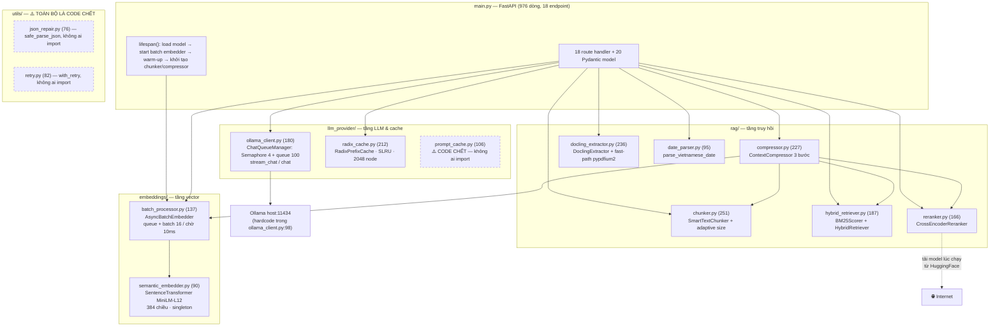
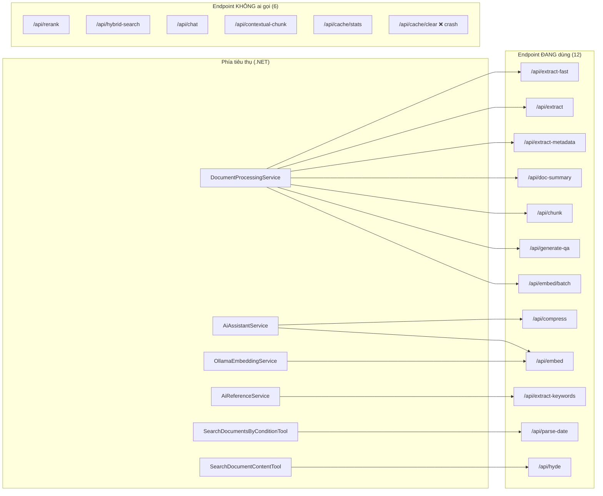
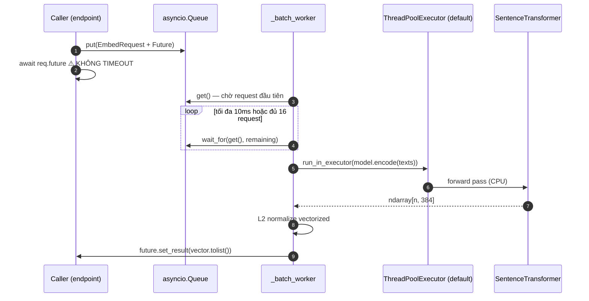
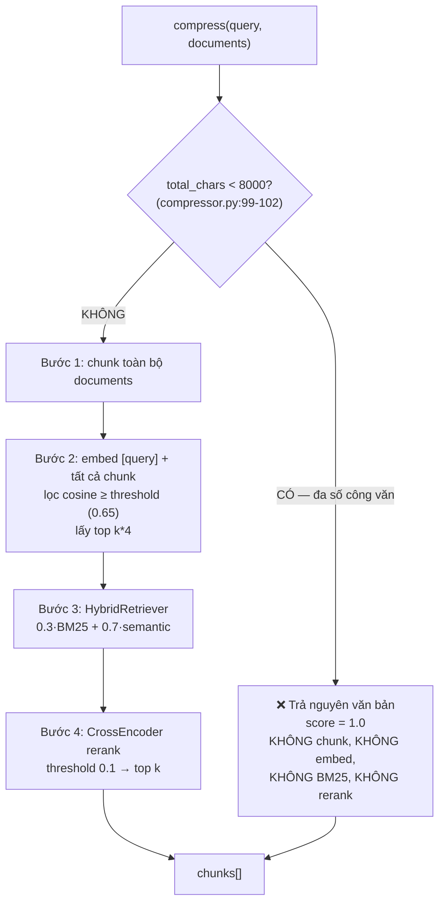
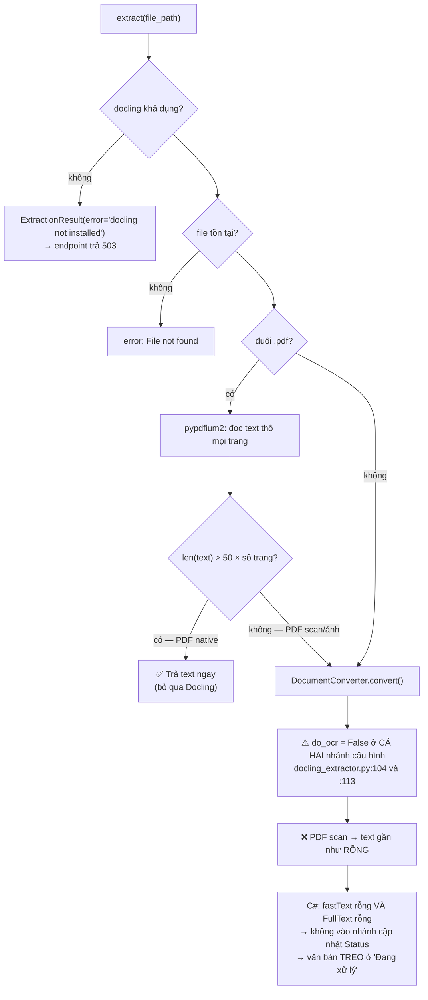
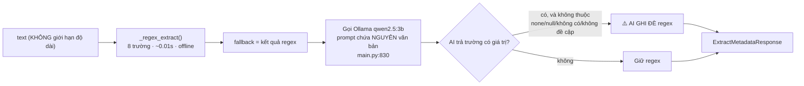
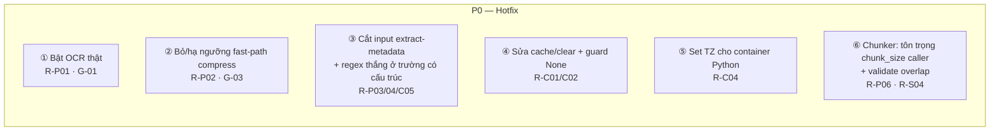
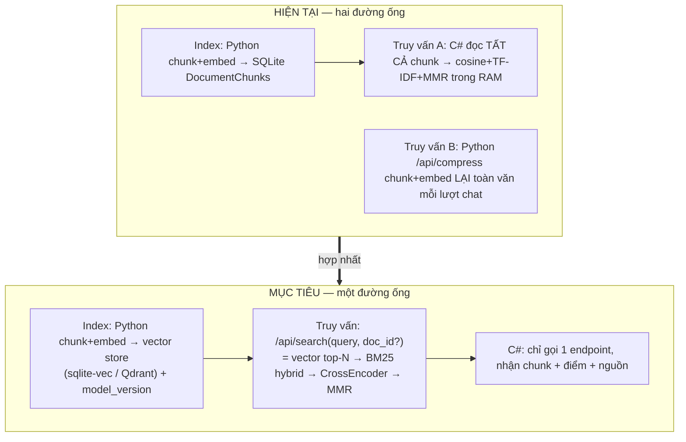

# Phân tích Chuyên sâu — `python-ai-service`

> **Phiên bản tài liệu**: 1.0 · **Ngày lập**: 22/08/2026
> **Đối tượng phân tích**: `python-ai-service/` (3.021 dòng Python, 14 module) tại nhánh `develop`, commit cuối chạm service: `7d8f6fb` (20/08/2026)
> **Phương pháp**: đọc 100% mã nguồn service + đối chiếu với phía tiêu thụ (`ToolCalendar.Core/Services/PythonAiService.cs`, `DocumentProcessingService.cs`, `AiAssistantService.cs`, `AiReferenceService.cs`, `OllamaEmbeddingService.cs`, `SearchDocumentsByConditionTool.cs`) và cấu hình vận hành (`docker-compose.yml`, `Dockerfile`).
> **Tài liệu liên quan**: [ARCHITECTURE.md](ARCHITECTURE.md) (kiến trúc toàn hệ thống)

---

## Mục lục

1. [Tóm tắt điều hành](#1-tóm-tắt-điều-hành)
2. [Bản đồ module & inventory](#2-bản-đồ-module--inventory)
3. [Ma trận endpoint: khai báo vs thực dùng](#3-ma-trận-endpoint-khai-báo-vs-thực-dùng)
4. [Phân tích từng thành phần](#4-phân-tích-từng-thành-phần)
5. [Ưu điểm](#5-ưu-điểm)
6. [Nhược điểm](#6-nhược-điểm)
7. [Gap analysis — tuyên bố vs thực tế](#7-gap-analysis--tuyên-bố-vs-thực-tế)
8. [Rủi ro tiềm ẩn](#8-rủi-ro-tiềm-ẩn)
9. [Chiến lược giải quyết](#9-chiến-lược-giải-quyết)
10. [Lộ trình & tiêu chí hoàn thành](#10-lộ-trình--tiêu-chí-hoàn-thành)
11. [Phụ lục — bộ lệnh chẩn đoán](#11-phụ-lục--bộ-lệnh-chẩn-đoán)

---

## 1. Tóm tắt điều hành

### 1.1. Đánh giá tổng quan

`python-ai-service` là một **thư viện kỹ thuật RAG chất lượng cao bị đặt trong một service chưa hoàn thiện về mặt vận hành**. Chất lượng thuật toán (BM25 tự cài, CrossEncoder 2-stage, batch embedder, radix cache, FCFS queue) ở mức trên trung bình so với các dự án nội bộ cùng quy mô — nhưng phần lớn năng lực đó **không đến được người dùng** vì các đường ống tiêu thụ bị ngắt, tắt, hoặc bị bỏ qua bởi fast-path.

| Tiêu chí | Điểm | Nhận xét |
|---|:--:|---|
| Chất lượng thuật toán RAG | 8/10 | Pipeline 3 tầng đúng lý thuyết, tham số hợp lý, có nguồn tham chiếu rõ ràng |
| Độ hoàn thiện chức năng | 4/10 | OCR bị tắt hoàn toàn; compress bị fast-path vô hiệu hóa với đa số tài liệu |
| Tính đúng đắn (correctness) | 5/10 | 1 endpoint crash chắc chắn, 3 lỗi logic ảnh hưởng nghiệp vụ |
| Bảo mật | 3/10 | Không xác thực, không giới hạn input, đọc file tùy ý theo path |
| Khả năng vận hành | 4/10 | Health check giả dương, không metric, không cấu hình qua env, log không có ngày |
| Khả năng bảo trì | 5/10 | ~370 dòng code chết, 3 chuỗi version khác nhau, 0 test tự động |
| Khả năng chịu tải | 4/10 | 1 worker + 1.5 vCPU + threadpool không giới hạn → thrash/OOM khi upload hàng loạt |
| **Tổng thể** | **4.7/10** | Nền tảng tốt, cần một đợt "hardening" tập trung trước khi tăng tải |

### 1.2. Năm phát hiện quan trọng nhất

| # | Phát hiện | Bằng chứng | Hệ quả nghiệp vụ |
|:--:|---|---|---|
| **1** | **Service không có bất kỳ năng lực OCR nào.** `do_ocr = False` ở **cả hai** nhánh cấu hình, và `requirements.txt` không có engine OCR nào (tesseract/paddle/easyocr/rapidocr) | `rag/docling_extractor.py:104` và `:113`; `requirements.txt` | Công văn giấy **scan thành ảnh** → `FullText` rỗng → không có metadata, không có chunk RAG, và văn bản **treo vĩnh viễn ở trạng thái "Đang xử lý"** (xem §8 R-P01) |
| **2** | **Toàn bộ pipeline `/api/compress` bị vô hiệu hóa với đa số công văn** do fast-path bỏ qua khi tổng nội dung < 8.000 ký tự — trả về nguyên văn bản với `score = 1.0` | `rag/compressor.py:99-102` | Trợ lý AI nhận nguyên văn thay vì đoạn liên quan → prompt dài, chậm, dễ nhiễu; nhãn `[Đoạn 1 - Liên quan: 100%]` sai sự thật |
| **3** | **Endpoint `/api/cache/clear` crash 100%**: gọi `_radix_cache.cache` nhưng `RadixPrefixCache` không có thuộc tính `.cache` (chỉ có `_root` và method `clear()`) | `main.py:476` vs `llm_provider/radix_cache.py:207` | Không có cách nào xóa cache embedding → không thể đổi model embedding an toàn |
| **4** | **`extract-metadata` gửi nguyên văn bản không giới hạn vào LLM** và ghi đè kết quả regex bằng output AI; chính commit `7d8f6fb` đã đảo ngược tối ưu của commit `20f9976` ("100% regex, 0.01s, chống ảo giác") | `main.py:826-851` (`Văn bản:\n{request.text}`) | Latency hot-path upload từ **0,01s → 40–60s** (theo chính comment trong code), tái lập nguy cơ ảo giác, và tràn context với văn bản dài |
| **5** | **`RadixPrefixCache` không phải radix tree**: mọi entry là con trực tiếp của root theo khóa `sha256(toàn văn)`; `_tokenize()` được gọi nhưng kết quả không dùng → **không có prefix sharing** | `llm_provider/radix_cache.py:142-158` | Lợi ích "tiết kiệm memory nhờ prefix" trong tài liệu là không có thật; eviction quét O(N) toàn bộ node |

### 1.3. Kết luận nhanh

Service **không cần viết lại**. Ba mươi phần trăm giá trị bị mất đến từ 5 lỗi cụ thể ở §1.2 — tất cả đều sửa được trong vòng 1–2 ngày công. Phần còn lại là công việc hardening có thể lên kế hoạch (xác thực, giới hạn input, quan sát được, kiểm thử).

---

## 2. Bản đồ module & inventory



### 2.1. Inventory chi tiết

| Module | Dòng | Vai trò | Trạng thái |
|---|--:|---|---|
| `main.py` | 976 | FastAPI app, 18 endpoint, 20 model | ✅ dùng · ⚠️ chứa ~40 dòng code chết |
| `rag/chunker.py` | 251 | Recursive splitter + adaptive size + late-chunking | ✅ dùng · ⚠️ ghi đè `chunk_size` của caller |
| `rag/docling_extractor.py` | 236 | Trích xuất PDF/Office | ⚠️ dùng nhưng **OCR bị tắt** |
| `rag/compressor.py` | 227 | Pipeline RAG 3 bước | ⚠️ dùng nhưng **fast-path bỏ qua** với doc < 8k ký tự |
| `llm_provider/radix_cache.py` | 212 | Cache embedding | ⚠️ dùng · không đúng như tên gọi |
| `rag/hybrid_retriever.py` | 187 | BM25 + semantic | ⚠️ chỉ được gọi **bên trong** compressor; endpoint riêng không ai dùng |
| `llm_provider/ollama_client.py` | 180 | Gọi Ollama + điều tiết đồng thời | ✅ dùng · ⚠️ hardcode URL |
| `rag/reranker.py` | 166 | CrossEncoder rerank | ⚠️ model **không** được bake vào image → cần Internet lần đầu |
| `embeddings/batch_processor.py` | 137 | Batch embedding queue | ✅ dùng · ⚠️ không có timeout |
| `llm_provider/prompt_cache.py` | 106 | LRU + TTL cache | ❌ **code chết** |
| `rag/date_parser.py` | 95 | Parse ngày tiếng Việt | ✅ dùng · ⚠️ sai múi giờ, thiếu "tháng sau"/"năm sau" |
| `embeddings/semantic_embedder.py` | 90 | Wrapper SentenceTransformer | ✅ dùng (chỉ `.model`) · 2 method công khai không ai gọi |
| `utils/retry.py` | 82 | Decorator retry | ❌ **code chết** |
| `utils/json_repair.py` | 76 | Parse JSON LLM hỏng | ❌ **code chết** (dù đây chính là thứ `/api/generate-qa` đang cần) |
| **Tổng** | **3.021** | | **~370 dòng (12%) là code chết** |

### 2.2. Vấn đề hygiene mã nguồn

| Vấn đề | Chi tiết |
|---|---|
| `.pyc` được commit vào Git | 6 file `rag/__pycache__/*.cpython-312.pyc` vẫn nằm trong index dù commit `de6c5c6` mang tên "cleanup python cache khỏi git" — dọn chưa xong |
| Lệch phiên bản Python | `.pyc` biên dịch bằng **3.12** trong khi image là `python:3.11-slim` → dev và prod khác runtime |
| `.dockerignore` không loại `__pycache__` | `.pyc` rác được COPY vào image |
| Không có `__init__.py` | `rag/`, `utils/`, `embeddings/`, `llm_provider/` đều là namespace package (PEP 420) — chạy được nhưng dễ vỡ khi đóng gói; đáng chú ý là `rag/__pycache__/__init__.cpython-312.pyc` tồn tại trong Git trong khi `rag/__init__.py` **không** tồn tại |
| Ba chuỗi phiên bản khác nhau | docstring `v3.0` (`main.py:2`), `FastAPI(version="2.0.0")` (`:108`), `/health` trả `"3.1.0"` (`:278`) |
| Import cục bộ rải rác | `import re/json/os/calendar/torch` bên trong hàm — che giấu phụ thuộc, khó phân tích tĩnh |
| `if __name__ == "__main__"` đặt giữa file | `main.py:890`, **trước** khi `/api/hyde` được khai báo (`:895`) — hoạt động được nhưng cực dễ gây lỗi khi refactor |
| `uvicorn.run(..., reload=True)` | Chế độ reload bật cứng trong entry dev |

---

## 3. Ma trận endpoint: khai báo vs thực dùng



| Endpoint | Người gọi | Trạng thái | Ghi chú |
|---|---|:--:|---|
| `/health` | Docker healthcheck, Uptime Kuma | ✅ | **Giả dương** — xem R-O01 |
| `/api/embed` | `OllamaEmbeddingService.cs` (tên class gây nhầm — nó gọi Python, không gọi Ollama) | ✅ | Timeout phía C# chỉ **10s** |
| `/api/embed/batch` | `DocumentProcessingService` | ✅ | Giới hạn 100 text, không giới hạn tổng byte |
| `/api/chunk` | `DocumentProcessingService` (2 lần: parent + child) | ✅ | `chunk_size` bị adaptive ghi đè — xem R-C02 |
| `/api/compress` | `AiAssistantService` | ⚠️ | Fast-path vô hiệu hóa với đa số doc |
| `/api/extract` | `DocumentExtractorService` | ⚠️ | Chỉ `text` được dùng, `markdown`/`tables_count`/`num_pages` bị **bỏ đi** |
| `/api/extract-fast` | `DocumentProcessingService` | ✅ | |
| `/api/extract-metadata` | `DocumentProcessingService` (2 nhánh) | ⚠️ | Không giới hạn độ dài input |
| `/api/doc-summary` | `DocumentProcessingService` | ✅ | Có cắt 4.000 ký tự ✓ |
| `/api/generate-qa` | `DocumentProcessingService` (chỉ 2 parent đầu) | ⚠️ | `except json.JSONDecodeError: pass` → im lặng mất QA |
| `/api/hyde` | `SearchDocumentContentTool` | ✅ | |
| `/api/extract-keywords` | `AiReferenceService` | ✅ | |
| `/api/parse-date` | `SearchDocumentsByConditionTool` | ⚠️ | Sai múi giờ — xem R-C04 |
| `/api/contextual-chunk` | **không ai** (C# có `ContextualChunkAsync` nhưng 0 caller) | ❌ | `DocumentProcessingService` tự ghép chuỗi ngữ cảnh thay vì gọi endpoint này |
| `/api/rerank` | **không ai** | ❌ | Chỉ dùng nội bộ qua compressor |
| `/api/hybrid-search` | **không ai** | ❌ | Chỉ dùng nội bộ qua compressor |
| `/api/chat` | **không ai** (C# gọi thẳng Ollama:11434) | ❌ | Toàn bộ cơ chế FCFS queue **không** áp dụng cho chat của người dùng |
| `/api/cache/stats` | **không ai** | ❌ | |
| `/api/cache/clear` | **không ai** | ❌ | Crash nếu gọi |

> **Hệ quả quan trọng của dòng `/api/chat`**: `ChatQueueManager` (Semaphore 4 + queue FCFS 100) được thiết kế để "100 user đồng thời không ai timeout", nhưng **chat của người dùng đi trực tiếp từ C# tới Ollama**, không qua service này. Cơ chế điều tiết chỉ áp dụng cho các lời gọi nội bộ (metadata, summary, QA, HyDE, keywords). Nói cách khác: **hàng đợi bảo vệ sai đối tượng**.

---

## 4. Phân tích từng thành phần

### 4.1. Tầng embedding — `AsyncBatchEmbedder` + `SemanticEmbedder`



**Ưu điểm**
- Gom batch đúng pattern (chờ tối đa 10ms, tối đa 16 text) → giảm số forward pass khi nhiều request đến gần nhau.
- L2 normalize vectorized trên cả batch, có bảo vệ chia 0 (`batch_processor.py:118`).
- Warm-up model lúc startup (`main.py:81`) → request đầu tiên không bị cold-start.
- Đặt `model.encode` vào executor → **không block event loop**.

**Nhược điểm / rủi ro**
- `await req.future` **không có timeout** (`batch_processor.py:69`). Nếu worker chết hoặc `start()` chưa được gọi, request treo vĩnh viễn; phía C# chờ tới 10 phút (HttpClient timeout).
- `EmbedRequest.future` dùng `default_factory` gọi `asyncio.get_event_loop()` ở thời điểm định nghĩa dataclass (`batch_processor.py:34`) — API đã deprecated; may mắn là mọi call site đều truyền `future` tường minh.
- `run_in_executor(None, ...)` dùng threadpool mặc định của asyncio (tối đa `min(32, cpu+4)` thread). Kết hợp `torch` không giới hạn số thread nội bộ và `cpus: "1.5"` → **CPU oversubscription** nghiêm trọng.
- `SemanticEmbedder.embed_text()` và `embed_batch_sync()` không ai gọi — batch embedder truy cập trực tiếp `.model`, phá vỡ đóng gói.
- Không có phiên bản model đi kèm vector → xem R-A01.

### 4.2. Cache embedding — `RadixPrefixCache`

**Thực tế cài đặt** (`radix_cache.py:142-158`):

```python
def _find_or_create_node(self, text: str) -> _TreeNode:
    full_key = self._make_full_key(text)   # sha256 toàn văn
    tokens = self._tokenize(text)          # ⚠️ tính rồi KHÔNG dùng
    current = self._root
    if full_key not in current.children:   # ⚠️ mọi node là con trực tiếp của root
        ...
```

| Tuyên bố trong docstring | Thực tế |
|---|---|
| "Prefix sharing: tiết kiệm memory khi nhiều câu có chung đầu" | ❌ Không có prefix sharing — cây luôn sâu 1 tầng, khóa là hash toàn văn |
| "O(k) lookup với k = số token trong prefix" | Thực tế O(1) hash lookup (tốt hơn, nhưng khác mô tả) |
| "Eviction thông minh hơn LRU (SLRU)" | ✅ Đúng — SLRU có bảo vệ node hot (`hit_count >= 3`) |

**Nhược điểm khác**
- `_evict_one()` duyệt **toàn bộ** node để thu thập lá rồi `min()` → O(N) mỗi lần evict (N = 2048, chấp nhận được nhưng không cần thiết).
- `put()` trên khóa đã tồn tại không refresh `last_access_time` → thống kê hit/miss lệch.
- Vector lưu dạng `list[float]` Python: ~12–13KB/vector (so với 1,5KB nếu dùng `np.float32`) → 2048 node ≈ **27MB** thay vì ~3MB.
- **Không có TTL** và **không thể xóa** (endpoint clear crash) → cache tồn tại đến khi restart container.
- `prompt_cache.py` cài sẵn LRU **có TTL** nhưng bị bỏ rơi — giải pháp đã tồn tại trong repo mà không được dùng.

### 4.3. Chunker — `SmartTextChunker`

**Ưu điểm**
- Recursive splitter với danh sách separator ưu tiên hợp lý cho tiếng Việt.
- `with_header()` chèn metadata (`sourceDocument`, `published`, `source`) vào chunk → LLM trích dẫn chính xác hơn.
- Late-chunking: gộp chunk < 80 ký tự vào chunk trước (`:191`) → tránh chunk rác.
- Làm sạch nhiễu OCR bằng regex giữ đúng dải Unicode tiếng Việt: `U+00C0–024F` (Ă Đ Ơ Ư) và `U+1E00–1EFF` (ạ ả ấ…) đều được bảo toàn ✓.

**Nhược điểm / lỗi**
- **Ghi đè tham số của caller** (`:225-227`): `chunk_document()` gọi `compute_adaptive_chunk_size()` rồi gán vào `self.chunk_size`, **bỏ qua giá trị caller truyền vào**. Hệ quả cụ thể với hợp đồng parent/child của `DocumentProcessingService`:

  | Độ dài FullText | C# yêu cầu parent 1500 | Thực nhận | C# yêu cầu child 400 | Thực nhận |
  |---|:--:|:--:|:--:|:--:|
  | < 2.000 ký tự | 1500 | **400** | 400 | 400 |
  | 2.000–10.000 | 1500 | 1500 ✓ | 400 | 400 ✓ |
  | > 10.000 | 1500 | 1500 ✓ | 400 | **800** |

  → Với văn bản dài, child chunk phình lên 800 ký tự, thu hẹp khoảng cách parent/child từ 3,75× xuống 1,875× — làm giảm chính lợi ích mà kiến trúc parent/child hướng tới.
- **Nguy cơ đệ quy vô hạn**: nhánh fallback `:172-176` cắt theo bước `chunk_size - chunk_overlap`. Nếu `chunk_overlap >= chunk_size` (không có validation nào trong `ChunkRequest`), bước ≤ 0 → đệ quy không thu hẹp → `RecursionError` hoặc treo. Đây là vector DoS trivially reachable: `POST /api/chunk {"text":"...","chunk_size":10,"chunk_overlap":1000}`.
- Separator `"。"` (U+3002) nằm trong danh sách nhưng đã bị regex làm sạch xóa trước đó → nhánh chết.
- Log `:248` in `base=self.chunk_size` sau khi đã restore → nhãn "base" dễ gây hiểu nhầm khi debug.

### 4.4. Compressor — trái tim của RAG, và cũng là điểm hỏng lớn nhất



**Ưu điểm**
- Pipeline 3 tầng đúng lý thuyết two-stage retrieval; mỗi tầng có thể bật/tắt qua constructor.
- Lazy-load reranker, có `try/except` ở mọi tầng và degrade về kết quả tầng trước — không bao giờ vỡ toàn bộ.
- Embed `[query] + chunks` trong **một** batch (`:141-146`) → tiết kiệm 1 forward pass.

**Nhược điểm / lỗi**
- **Fast-path 8.000 ký tự giết pipeline** (R-C01). Công văn hành chính Việt Nam điển hình dài 2.000–6.000 ký tự → **hầu hết** lời gọi rơi vào nhánh bypass. Chuỗi context trả về gắn nhãn `[Đoạn 1 - Liên quan: 100%]` (`main.py:518`) — con số bịa, gây hiểu sai cho cả người đọc log và LLM.
- **RAG hai đường ống song song, không nhất quán**:

  | Đường ống | Nguồn vector | Nơi tính similarity | Ai dùng |
  |---|---|---|---|
  | (A) Index sẵn | `DocumentChunks` trong SQLite (parent/child/summary/QA) | C# in-process cosine + TF-IDF + MMR | `search_document_content` tool |
  | (B) Tại-thời-điểm-hỏi | Không lưu — chunk & embed lại **mỗi lượt chat** | Python compressor | Chat khi có `documentId` |

  → Cùng một tài liệu bị chunk theo **hai** chiến lược khác nhau, cho ra hai tập điểm khác nhau. Đường (B) bỏ hoàn toàn công sức index của đường (A) và trả tiền embed lại mỗi lượt hỏi.
- `main.py:493-500`: khi `similarity_threshold` được truyền (C# **luôn** truyền), một `ContextCompressor` **mới** được tạo cho mỗi request → tạo mới `HybridRetriever` + log spam mỗi lượt chat.
- `main.py:526`: `total_chunks_evaluated=0` hardcode kèm comment "Filled by compressor internally" — không bao giờ được điền. Hợp đồng API sai sự thật.
- `max_results` mặc định lệch: `DEFAULT_MAX_RESULTS = 8` (compressor) vs `CompressRequest.max_results = 8` vs C# truyền `max_results = 5` — ba nơi ba giá trị, không có nguồn chân lý.

### 4.5. Hybrid retriever & Reranker

**Ưu điểm**
- BM25 cài tay đúng công thức Okapi (k1=1.5, b=0.75), có IDF, có chuẩn hóa về [0,1] (`hybrid_retriever.py:108-112`).
- Validate `keyword_weight + semantic_weight == 1.0` ngay ở constructor → chặn cấu hình sai sớm.
- Reranker dùng `activation_fct=nn.Sigmoid()` để đưa logit về [0,1], có fallback nếu torch lỗi; có `tenacity` retry cho `RuntimeError`.

**Nhược điểm**
- `BM25Scorer._tokenize` = `text.lower().split()` — **không** xử lý dấu câu, không tách từ tiếng Việt. Truy vấn "công văn số 3206/SKHCN-BCVT&TĐC" sinh token dính dấu; `"3206/SKHCN"` và `"3206 / SKHCN"` là hai token khác nhau → đúng ngay ca dùng mà BM25 được thêm vào để giải quyết.
- `hybrid_retriever.py:170`: **ghi đè `score`** bằng `hybrid_score`. Sau bước hybrid, `score` không còn là semantic score; nếu ai đó chạy hybrid hai lần, điểm bị trộn lũy tiến (không xảy ra hiện tại nhưng là bẫy chờ).
- `rank-bm25` được khai báo trong `requirements.txt` nhưng **không bao giờ import** — cài đặt tay song song với thư viện đã có sẵn.
- **Model reranker không được bake vào image**: `Dockerfile` chỉ pre-download `paraphrase-multilingual-MiniLM-L12-v2`, không tải `cross-encoder/ms-marco-MiniLM-L-2-v2`. Lần rerank đầu tiên sẽ **gọi ra HuggingFace** — mâu thuẫn trực tiếp với cam kết trong `ollama_client.py:99`: *"Tuyệt đối không gọi ra Internet để đảm bảo bí mật dữ liệu công văn"*. Nếu server chặn outbound → `get_reranker()` raise → compressor log warning và **âm thầm bỏ tầng rerank**.
- CrossEncoder `ms-marco-MiniLM-L-2-v2` được huấn luyện chủ yếu trên **tiếng Anh** (MS MARCO). Docstring tự nhận "hỗ trợ tiếng Việt ở mức cơ bản" — với công văn tiếng Việt, tầng rerank có thể **làm xấu** thứ tự so với cosine thuần. Không có đo lường nào để biết.
- `rerank()` là `sync def` được gọi từ endpoint `sync def` → chạy trong threadpool; nhiều thread gọi `self.model.predict` trên cùng một module torch → tăng RAM đột biến, không có giới hạn đồng thời.

### 4.6. Docling extractor — nơi mất năng lực OCR



**Ưu điểm**
- Fast-path `pypdfium2` cho PDF native (ngưỡng > 50 ký tự/trang) → bỏ qua hoàn toàn pipeline PyTorch nặng, cực nhanh với văn bản điện tử.
- Kiểm tra `is_available` và trả 503 tường minh khi thiếu `docling` (thay vì crash).
- Mọi lỗi được bọc thành `ExtractionResult(error=...)` — dễ chẩn đoán.

**Nhược điểm / lỗi**
- **`do_ocr = False` ở cả hai nhánh** (`:104`, `:113`). Nhánh "full pipeline" có comment `# Tắt OCR mặc định để tăng tốc độ cho PDF native` — nhưng nhánh này chỉ chạy khi fast-path **đã thất bại**, tức chính xác là trường hợp file scan **cần** OCR. Logic bị đảo ngược so với ý định.
- **Không có engine OCR trong `requirements.txt`** — kể cả khi bật `do_ocr=True`, Docling sẽ không tìm được backend OCR (cần `easyocr`/`tesserocr`/`rapidocr-onnxruntime`, không cái nào được cài).
- `docker-compose.yml` đặt `DOCLING_USE_SIMPLE_PIPELINE=true` → thêm cả `do_table_structure = False`. Vậy trong production, Docling chỉ còn là parser text — **mọi lợi thế bảng biểu/heading đều bị tắt**.
- **Kết quả cấu trúc bị vứt bỏ ở phía C#**: `DocumentExtractorService.ExtractFromFileAsync` chỉ lấy `result.Text`, bỏ `markdown`, `num_pages`, `tables_count`. Cột `Documents.OcrPagesJson` tồn tại nhưng không bao giờ được điền.
- `torch._dynamo.config.suppress_errors = True` trong `__init__` (`:87-88`) — che lỗi compile toàn cục cho cả process, không chỉ Docling.
- Cấu hình OCR của hệ thống (`OcrSettings__RenderDpi=400`, `MaxParallelPages`, `MaxPagesToScan`, `EnableOsd`, `EnableDeskew` trong `docker-compose.yml`) **không có dòng code nào đọc** ở phía Python → cấu hình chết, gây ảo tưởng "đã tinh chỉnh OCR".
- `/api/extract` là `sync def` → chạy trong threadpool không giới hạn. RabbitMQ prefetch = 8 → tối đa 8 phiên Docling đồng thời trong container `mem_limit 2560m`, `memswap_limit 2560m` (**không có swap**) → OOM-kill.

### 4.7. Ollama client & điều tiết đồng thời

**Ưu điểm**
- `ChatQueueManager` đúng pattern FCFS: kiểm tra độ sâu hàng chờ **trước** khi acquire, raise `OverflowError` khi đầy (backpressure thay vì timeout hàng loạt).
- `release()` nằm trong `finally` ở cả `stream_chat` và `chat` → không rò rỉ semaphore kể cả khi client ngắt kết nối giữa stream.
- Phân tách timeout connect (3s) và tổng (180s) → phát hiện Ollama chết nhanh.
- Có xử lý `json.JSONDecodeError` cho từng dòng stream.

**Nhược điểm**
- **URL Ollama hardcode** `http://host.docker.internal:11434` (`:98`) — không đọc env. Phía .NET có `Ollama__ChatUrl` cấu hình được; phía Python thì không → không thể trỏ sang Ollama khác mà không sửa code + rebuild.
- `OLLAMA_MAX_CONCURRENT = 4` là **giả định** về `OLLAMA_NUM_PARALLEL` của host, không có xác thực. Nếu host chạy mặc định (`=1`), 4 request "song song" sẽ xếp hàng **bên trong** Ollama, mỗi cái chậm gấp 4 → dễ vượt timeout 180s.
- Tạo `httpx.AsyncClient` mới cho **mỗi** request → không tái dùng connection pool.
- Không phân tách QoS: khi 8 file được OCR song song, các lời gọi `extract-metadata` + `doc-summary` + `generate-qa` chiếm hết 4 slot; các lời gọi tương tác (HyDE, keywords) phải chờ sau công việc nền.
- `chat()` trả `""` khi lỗi hoặc queue đầy → **không phân biệt được** "LLM trả rỗng" với "hệ thống quá tải"; caller không thể retry đúng cách.

### 4.8. Trích xuất metadata — điểm nóng nhất về latency

Luồng hiện tại (`main.py:701-851`):



**Ưu điểm**
- Regex làm **base** rất tốt: có xử lý ca thực tế đặc thù (số văn bản dính khoảng trắng, "ngày29tháng 07", loại bỏ "Quảng Ninh, ngày…" lọt vào trích yếu, ưu tiên từ khóa dài trước khi ghép pattern, có exclude-keyword để tránh bắt sai ngày sự kiện thành hạn xử lý, suy ra ngày cuối tháng khi văn bản chỉ ghi "trong tháng 8/2026").
- Từ khóa deadline lấy từ `AppSettings` phía C# → cấu hình được mà không sửa code.
- Có `try/except` bao quanh phần AI → lỗi LLM vẫn còn kết quả regex.

**Nhược điểm / lỗi**
- **Docstring nói dối**: *"Bóc tách siêu dữ liệu từ văn bản thô bằng Regex (siêu nhanh & không ảo giác)"* — trong khi thân hàm gọi LLM và cho AI **ghi đè** regex.
- **Hồi quy hiệu năng có chủ ý**: commit `20f9976` ("chuyển sang 100% regex để đạt 0.01s và chống ảo giác") bị commit `7d8f6fb` đảo ngược. Comment ngay trong code thừa nhận *"có thể chậm 40-60s trên CPU"*. Đây là **hot path của upload** — nhân với prefetch 8 file thì toàn bộ 4 slot Ollama bị chiếm bởi việc này.
- **Không cắt độ dài input** (`:830`) — khác với `/api/doc-summary` (cắt 4.000), `/api/contextual-chunk` (cắt 1.000), `/api/extract-keywords` (cắt 1.500). Công văn 50 trang → prompt vượt context của `qwen2.5:3b` → model cắt đầu/đuôi tùy ý → kết quả ngẫu nhiên hoặc timeout.
- **AI thắng regex vô điều kiện**: chỉ chặn 4 chuỗi rác cụ thể. Nếu AI bịa `SoVanBan = "123/QĐ-UBND"` khác với regex đọc được từ chính văn bản, dữ liệu bịa sẽ được ghi vào DB.
- `json.loads(response_text)` không có bảo vệ (`:836`) — nằm trong `try` chung nên rơi về regex, nhưng `utils/json_repair.safe_parse_json` viết sẵn cho đúng việc này lại **không được dùng**.
- `fallback_extract_metadata()` ở cuối file (`:939`) là **bản trùng lặp cũ hơn, yếu hơn** của `_regex_extract` và không ai gọi — mã chết gây nhầm lẫn khi bảo trì.

### 4.9. Date parser

**Ưu điểm**: xử lý được 10+ cách diễn đạt tiếng Việt tự nhiên; tính đúng biên tuần/tháng/năm; có fallback regex `dd/mm/yyyy` và "tháng X năm Y".

**Nhược điểm**
- **Sai múi giờ**: dùng `datetime.datetime.now()` = giờ **container**. `docker-compose.yml` đặt `TZ=Asia/Ho_Chi_Minh` cho backend nhưng **không** cho `python-ai-service` → container chạy UTC. Từ **00:00 đến 07:00 giờ Việt Nam**, "hôm nay" trả về **ngày hôm trước**. Ảnh hưởng trực tiếp `SearchDocumentsByConditionTool` → trợ lý AI báo cáo sai số liệu công văn đến hạn trong giờ làm việc sớm.
- Docstring hứa hỗ trợ **"tháng sau"** và **"năm sau"** — cả hai **không được cài đặt**, rơi xuống `return None, None`.
- `except: pass` trần (`:78`, `:92`) — bắt cả `KeyboardInterrupt`/`SystemExit`.

---

## 5. Ưu điểm

| # | Ưu điểm | Bằng chứng |
|---|---|---|
| 1 | **Chất lượng thuật toán RAG cao hơn mức trung bình**: two-stage retrieval (embed → hybrid → cross-encoder), adaptive chunk size, late-chunking, chunk header metadata, RAPTOR summary, QA-pair indexing, HyDE | `compressor.py`, `chunker.py`, `main.py` |
| 2 | **Mọi kỹ thuật đều ghi rõ nguồn tham chiếu** (llama.cpp, SGLang, vLLM, Dify, Khoj, gpt-researcher, anything-llm, Docling, Anthropic Contextual Retrieval) — hiếm thấy và cực kỳ giá trị cho người bảo trì sau | docstring toàn bộ module |
| 3 | **Graceful degradation nhất quán**: mỗi tầng RAG, mỗi lời gọi LLM đều có `try/except` + fallback hợp lý (rerank lỗi → dùng hybrid; HyDE lỗi → embed câu hỏi gốc; summary lỗi → 300 ký tự đầu; AI metadata lỗi → regex) | xuyên suốt |
| 4 | **Backpressure đúng cách** thay vì để timeout hàng loạt: `ChatQueueManager` raise `OverflowError` khi hàng chờ đầy, thông báo tiếng Việt thân thiện | `ollama_client.py:60-73` |
| 5 | **Batch embedding thực sự** với gom request theo cửa sổ thời gian + L2 normalize vectorized | `batch_processor.py` |
| 6 | **Fast-path PDF native** rất hiệu quả: bỏ qua toàn bộ pipeline PyTorch khi PDF đã có text | `docling_extractor.py:143-166` |
| 7 | **Regex trích metadata được tinh chỉnh theo dữ liệu thật** — xử lý nhiều ca lỗi OCR đặc thù công văn Việt Nam mà một LLM 3B khó làm tốt hơn | `main.py:707-812` |
| 8 | **Không block event loop** cho tác vụ CPU: `run_in_executor` cho embedding, `sync def` cho endpoint CPU-bound (FastAPI tự đẩy sang threadpool) | `batch_processor.py:110` |
| 9 | **Model embedding được bake vào image** lúc build → không cần Internet cho luồng chính, khởi động nhanh | `Dockerfile:16` |
| 10 | **Tách service đúng đắn**: cô lập ~2,5GB phụ thuộc AI khỏi backend .NET 512MB, cho phép CI chỉ rebuild khi `python-ai-service/` đổi | `docker-compose.yml`, `.github/workflows/deploy.yml` |

---

## 6. Nhược điểm

| # | Nhược điểm | Mức | Vị trí |
|---|---|:--:|---|
| 1 | Không có năng lực OCR — mâu thuẫn với chức năng cốt lõi được quảng bá | 🔴 | `docling_extractor.py:104,113` |
| 2 | Pipeline compress bị fast-path vô hiệu hóa với đa số tài liệu | 🔴 | `compressor.py:99-102` |
| 3 | RAG hai đường ống song song không nhất quán, embed lại mỗi lượt chat | 🔴 | `compressor.py` vs `DocumentChunkRepository.cs` |
| 4 | `extract-metadata` không giới hạn input + cho AI ghi đè regex → 40–60s trên hot path | 🔴 | `main.py:826-851` |
| 5 | Không xác thực, không giới hạn kích thước request, đọc file theo `file_path` tùy ý | 🔴 | toàn bộ `main.py` |
| 6 | `/api/cache/clear` crash chắc chắn | 🟠 | `main.py:476` |
| 7 | Biến global (`_batch_embedder`, `_ollama_client`, `_chunker`, `_compressor`) dùng mà không kiểm tra `None` | 🟠 | `main.py:313,356,404,452,458,493,659,682,835,871` |
| 8 | `await req.future` không timeout → treo request nếu worker chết | 🟠 | `batch_processor.py:69` |
| 9 | Chunker ghi đè `chunk_size` của caller, phá hợp đồng parent/child | 🟠 | `chunker.py:225-227` |
| 10 | Nguy cơ đệ quy vô hạn khi `chunk_overlap >= chunk_size` (không validate) | 🟠 | `chunker.py:172-176` |
| 11 | Model reranker tải từ Internet lúc chạy — trái cam kết offline | 🟠 | `Dockerfile` vs `reranker.py:43` |
| 12 | Reranker dùng model tiếng Anh (MS MARCO) cho văn bản tiếng Việt, không đo lường | 🟠 | `reranker.py:43` |
| 13 | Sai múi giờ trong `date_parser` (container UTC) | 🟠 | `date_parser.py:19` |
| 14 | `/health` giả dương — xanh trong khi OCR/Ollama/batch worker đã chết | 🟠 | `main.py:269-288` |
| 15 | Hàng đợi FCFS bảo vệ sai đối tượng (chat người dùng không đi qua service) | 🟠 | `/api/chat` không ai gọi |
| 16 | Torch không giới hạn số thread + threadpool không giới hạn + `cpus: 1.5` → thrash | 🟠 | `Dockerfile`, `docker-compose.yml` |
| 17 | ~370 dòng code chết (12% codebase), gồm 3 module hoàn toàn không dùng | 🟡 | `prompt_cache.py`, `utils/*` |
| 18 | Phụ thuộc khai báo mà không dùng: `scikit-learn`, `langchain-text-splitters`, `rank-bm25`, `json-repair`, `torchvision`, `torchaudio` | 🟡 | `requirements.txt`, `Dockerfile:14` |
| 19 | Phụ thuộc không pin phiên bản (9/12 dùng `>=`) → build không tái lập | 🟡 | `requirements.txt` |
| 20 | Ba chuỗi phiên bản khác nhau trong cùng file | 🟡 | `main.py:2,108,278` |
| 21 | Container chạy `root`, không `no-new-privileges`, còn `build-essential`/`gcc` trong image cuối | 🟡 | `Dockerfile` |
| 22 | Không có test tự động nào; các `test_*.py` ở thư mục gốc là script ad-hoc cần server sống | 🟡 | repo root |
| 23 | Không có metric/trace/request-id; log không có ngày (`datefmt="%H:%M:%S"`) | 🟡 | `main.py:44-49` |
| 24 | Log ghi 40 ký tự truy vấn người dùng và tên file công văn ở mức INFO | 🟡 | `reranker.py:130`, `hybrid_retriever.py:181` |
| 25 | Không có `model_version` gắn với vector → đổi model làm hỏng âm thầm toàn bộ similarity | 🟠 | thiếu ở cả hai phía |

---

## 7. Gap analysis — tuyên bố vs thực tế

Đây là bảng quan trọng nhất của tài liệu: mọi dòng đều là một khoảng cách giữa những gì tài liệu/docstring/tên gọi hứa và những gì mã nguồn thực sự làm.

| # | Tuyên bố | Thực tế trong code | Khoảng cách |
|:--:|---|---|---|
| G-01 | README: "**AI OCR (Industrial Edition)** — tự động bóc tách với độ chính xác cao" | `do_ocr=False` ×2, không có engine OCR nào được cài | **Năng lực không tồn tại** |
| G-02 | `docling_extractor.py` docstring: "hiểu LAYOUT: bảng biểu, heading, cột" | Production bật `DOCLING_USE_SIMPLE_PIPELINE=true` → `do_table_structure=False`; và C# vứt bỏ `markdown`/`tables_count` | **Tắt ở hạ tầng + vứt ở tiêu thụ** |
| G-03 | `main.py:2`: "Endpoints: POST /api/compress — RAG pipeline 3 bước" | Bypass khi < 8.000 ký tự (đa số công văn) | **Không chạy trong ca phổ biến nhất** |
| G-04 | `radix_cache.py`: "Prefix sharing tiết kiệm memory", "O(k) lookup" | Flat dict theo `sha256(toàn văn)`, `_tokenize()` bị bỏ | **Tên gọi và mô tả sai bản chất** |
| G-05 | `ollama_client.py:99`: "Tuyệt đối không gọi ra Internet để đảm bảo bí mật dữ liệu công văn" | Reranker tải model từ HuggingFace lần chạy đầu | **Vi phạm cam kết bảo mật** |
| G-06 | `extract_metadata` docstring: "bằng Regex (siêu nhanh & không ảo giác)" | Gọi LLM và cho AI ghi đè regex; comment thừa nhận 40–60s | **Docstring trái ngược thân hàm** |
| G-07 | `ollama_client.py:35-42`: "100 user đồng thời → tối đa 4 chạy, 96 xếp hàng FCFS, không ai timeout" | `/api/chat` không ai gọi; chat người dùng đi thẳng C# → Ollama | **Cơ chế không nằm trên đường đi của tải thật** |
| G-08 | `date_parser` docstring: "Hỗ trợ … tháng sau, năm sau" | Không có nhánh nào xử lý; trả `None, None` | **Chức năng chưa cài** |
| G-09 | `CompressResponse.total_chunks_evaluated` + comment "Filled by compressor internally" | Hardcode `0` | **Hợp đồng API sai** |
| G-10 | `docker-compose.yml`: `OcrSettings__RenderDpi=400`, `MaxPagesToScan=7`, `EnableOsd`, `EnableDeskew` | Không dòng code Python nào đọc các biến này | **Cấu hình chết, gây ảo tưởng đã tinh chỉnh** |
| G-11 | `requirements.txt` khai báo `rank-bm25`, `json-repair`, `scikit-learn`, `langchain-text-splitters` | BM25 cài tay; `safe_parse_json` viết sẵn nhưng không import; sklearn và langchain không dùng | **Phụ thuộc ma** |
| G-12 | `main.py` docstring "v3.0" | `FastAPI(version="2.0.0")`, `/health` → `"3.1.0"` | **Không có nguồn chân lý phiên bản** |
| G-13 | Class name `OllamaEmbeddingService` (phía C#) | Gọi `python-ai-service:8001/api/embed`, không liên quan Ollama | **Tên gọi gây hiểu sai kiến trúc** |
| G-14 | `compute_adaptive_chunk_size` — "DIFY Idea: Adaptive Chunk Size" | Ghi đè `chunk_size` mà caller truyền tường minh | **Tối ưu tự động phá hợp đồng gọi** |
| G-15 | Commit `de6c5c6` "cleanup python cache khỏi git" | 6 file `.pyc` vẫn còn trong Git index | **Dọn dẹp chưa hoàn tất** |

---

## 8. Rủi ro tiềm ẩn

Ký hiệu: **P** = production/chức năng · **S** = bảo mật · **C** = tính đúng đắn · **O** = vận hành · **A** = kiến trúc/dài hạn
Mức: 🔴 cao · 🟠 trung bình · 🟡 thấp

### 8.1. Rủi ro chức năng (P)

| ID | Mức | Rủi ro | Kích hoạt khi | Hệ quả | Vị trí |
|---|:--:|---|---|---|---|
| **R-P01** | 🔴 | **Công văn scan treo vĩnh viễn ở "Đang xử lý"** | Upload PDF scan/ảnh (công văn giấy đến — ca phổ biến nhất) | `fastText` rỗng → nhánh cập nhật status không chạy; `FullText` rỗng → nhánh thứ hai cũng không chạy → status không bao giờ rời "Đang xử lý"; không có chunk RAG; văn bản vô hình với trợ lý AI | `docling_extractor.py:104,113` + `DocumentProcessingService.cs:279-301` |
| **R-P02** | 🔴 | **Trợ lý AI nhận nguyên văn thay vì đoạn liên quan** | Chat có `documentId`, tài liệu < 8.000 ký tự | Prompt phình, LLM 1.5B dễ nhiễu/ảo giác, chậm; nhãn "Liên quan: 100%" khiến LLM tin tuyệt đối | `compressor.py:99-102` |
| **R-P03** | 🟠 | **Upload chậm 40–60s/file** | Mọi upload có text (mọi PDF native) | Với prefetch 8, toàn bộ 4 slot Ollama bị công việc nền chiếm; người dùng chat cùng lúc bị xếp hàng sau | `main.py:826-851` |
| **R-P04** | 🟠 | **Tràn context LLM với văn bản dài** | Công văn > ~10 trang | Prompt vượt context `qwen2.5:3b` → metadata ngẫu nhiên hoặc timeout 180s | `main.py:830` |
| **R-P05** | 🟠 | **Tầng rerank âm thầm bị bỏ** | Server chặn outbound HTTPS (đúng như thiết kế bảo mật) | RAG mất tầng chính xác nhất, không có log lỗi rõ ràng, không ai biết | `Dockerfile` + `reranker.py:43` |
| **R-P06** | 🟠 | **Child chunk phình 2× với văn bản dài** | `FullText > 10.000` ký tự | Kiến trúc parent/child mất tác dụng phân tách; recall giảm | `chunker.py:225-227` |
| **R-P07** | 🟡 | **Mất QA-pair âm thầm** | LLM trả JSON sai format | `except json.JSONDecodeError: pass` → `qa_pairs = []`, không log, không retry | `main.py:688-690` |

### 8.2. Rủi ro bảo mật (S)

| ID | Mức | Rủi ro | Kích hoạt khi | Hệ quả | Vị trí |
|---|:--:|---|---|---|---|
| **R-S01** | 🔴 | **Không có xác thực trên toàn bộ 18 endpoint** | Bất kỳ tiến trình nào trong network `tool-calendar-net` | Đọc/ghi tùy ý: bơm text để đốt CPU/LLM, đọc nội dung công văn qua `/api/extract`, làm cạn hàng đợi Ollama | toàn bộ `main.py` |
| **R-S02** | 🔴 | **Đọc file tùy ý theo `file_path`** | `POST /api/extract {"file_path": "/app/main.py"}` hoặc bất kỳ đường dẫn trong container | Lộ mã nguồn, cấu hình, và **toàn bộ thư mục `Uploads` được mount** (dù `:ro`) | `main.py:531-545`, `:550-572` |
| **R-S03** | 🟠 | **Không giới hạn kích thước request** | POST 100MB text vào `/api/chunk` hoặc `/api/compress` | OOM-kill container (`mem_limit 2560m`, **không swap**) → mất model đã warm, cold-start 30s+ | mọi Pydantic model thiếu `max_length` |
| **R-S04** | 🟠 | **DoS bằng đệ quy** | `POST /api/chunk {"chunk_size":10,"chunk_overlap":1000}` | `RecursionError` hoặc treo thread, lặp lại → cạn threadpool | `chunker.py:172-176` |
| **R-S05** | 🟠 | **Rò rỉ dữ liệu công văn ra Internet** | Lần rerank đầu tiên | Tải model từ HuggingFace: tuy chỉ tải xuống, nhưng phá vỡ giả định air-gap của hệ thống văn bản nhà nước | `reranker.py:43` |
| **R-S06** | 🟡 | **Log chứa nội dung nghiệp vụ** | Mọi truy vấn RAG | 40 ký tự truy vấn + tên file công văn vào `json-file` log (giữ 30MB), ai đọc được Docker log là đọc được | `reranker.py:130`, `hybrid_retriever.py:181`, `docling_extractor.py:196` |
| **R-S07** | 🟡 | **Container chạy root** | Luôn | Không có `USER` trong Dockerfile, không có `no-new-privileges` (khác với backend đã có) | `Dockerfile`, `docker-compose.yml` |

### 8.3. Rủi ro tính đúng đắn (C)

| ID | Mức | Rủi ro | Kích hoạt khi | Hệ quả | Vị trí |
|---|:--:|---|---|---|---|
| **R-C01** | 🟠 | **`/api/cache/clear` trả 500** | Bất cứ khi nào được gọi | `AttributeError: 'RadixPrefixCache' object has no attribute 'cache'` — không thể invalidate cache | `main.py:476` |
| **R-C02** | 🟠 | **500 hàng loạt nếu startup lỗi một phần** | Model tải lỗi / `lifespan` raise giữa chừng | `_batch_embedder`/`_ollama_client` = `None` → `AttributeError` ở 10 vị trí; `/health` vẫn trả `"ok"` | `main.py:313,356,404,452,458,493,659,682,835,871` |
| **R-C03** | 🟠 | **Treo request vô thời hạn** | Batch worker chết vì lỗi ngoài `CancelledError` | `await req.future` không timeout → C# chờ tới 10 phút → luồng OCR đóng băng | `batch_processor.py:69` |
| **R-C04** | 🟠 | **"Hôm nay" sai một ngày** | Từ 00:00–07:00 giờ Việt Nam | Trợ lý AI báo cáo sai công văn đến hạn; container Python chạy UTC vì compose không set `TZ` | `date_parser.py:19` + `docker-compose.yml` |
| **R-C05** | 🟠 | **AI ghi đè dữ liệu đúng bằng dữ liệu bịa** | LLM trả `SoVanBan`/`ThoiHan` khác regex | Sai lệch dữ liệu gốc trong DB, chỉ chặn được 4 chuỗi rác cụ thể | `main.py:843-849` |
| **R-C06** | 🟡 | **Chất lượng embedding truy vấn suy giảm âm thầm** | Batch queue bận vì OCR hàng loạt | Timeout 10s phía C# → `float[0]` → semantic cache, semantic router, long-term memory **cùng lúc** trở thành no-op (đều bị `if (vector.Length > 0)` bỏ qua), không có log cảnh báo | `OllamaEmbeddingService.cs:50` + `batch_processor.py` |
| **R-C07** | 🟡 | **BM25 vô hiệu với đúng ca dùng nó được thêm vào** | Truy vấn số hiệu "3206/SKHCN-BCVT&TĐC" | `tokenize = lower().split()` không xử lý dấu câu → token không khớp | `hybrid_retriever.py:57` |

### 8.4. Rủi ro vận hành (O)

| ID | Mức | Rủi ro | Kích hoạt khi | Hệ quả | Vị trí |
|---|:--:|---|---|---|---|
| **R-O01** | 🟠 | **Health check giả dương** | OCR chết / Ollama chết / batch worker chết | `/health` chỉ đọc biến trong RAM → Uptime Kuma xanh, Docker không restart, sự cố kéo dài vô hạn cho tới khi người dùng phàn nàn | `main.py:269-288` |
| **R-O02** | 🟠 | **CPU thrash / OOM khi upload hàng loạt** | 8 message RabbitMQ song song | Docling + CrossEncoder + torch (không giới hạn thread) trong `cpus: 1.5`, `mem 2560m`, **không swap** → OOM-kill, mất cache, cold-start | `docker-compose.yml`, `Dockerfile` |
| **R-O03** | 🟠 | **Build không tái lập** | Rebuild sau vài tuần | 9/12 phụ thuộc dùng `>=` (đặc biệt `docling>=2.0.0` và `torch` không pin) → cùng Dockerfile cho ra image khác nhau | `requirements.txt`, `Dockerfile:14` |
| **R-O04** | 🟡 | **Không thể trỏ Ollama sang host khác** | Đổi hạ tầng LLM | URL hardcode → phải sửa code + rebuild + redeploy | `ollama_client.py:98` |
| **R-O05** | 🟡 | **Không quan sát được** | Khi cần điều tra chậm/lỗi | Không metric, không trace, không request-id, log không có ngày; `/api/cache/stats` tồn tại nhưng không ai thu | `main.py:44-49` |
| **R-O06** | 🟡 | **Không có test tự động** | Mọi lần sửa | CI chỉ build+deploy; 5 lỗi ở §1.2 đều thuộc loại một test tích hợp cơ bản sẽ bắt được | repo |

### 8.5. Rủi ro kiến trúc dài hạn (A)

| ID | Mức | Rủi ro | Hệ quả | Vị trí |
|---|:--:|---|---|---|
| **R-A01** | 🔴 | **Không có `model_version` gắn với vector** | Đổi/nâng cấp model embedding sẽ làm toàn bộ `DocumentChunks.VectorJson` (384 chiều, không gian cũ) trở thành rác **âm thầm** — cosine vẫn trả số, chỉ là vô nghĩa. Không có cách phát hiện, và `/api/cache/clear` để invalidate thì crash | `DocumentChunks` schema + `radix_cache.py` |
| **R-A02** | 🔴 | **RAG hai đường ống song song** | Cùng tài liệu, hai chiến lược chunk, hai tập điểm; đường (B) embed lại toàn văn mỗi lượt chat; sửa lỗi ở một đường không sửa được đường kia | `compressor.py` vs `DocumentChunkRepository.cs` |
| **R-A03** | 🟠 | **Không có separation of concerns về QoS** | Công việc nền (OCR) và tương tác (chat) tranh cùng 4 slot Ollama, không có ưu tiên; tăng tải OCR làm giảm trực tiếp trải nghiệm chat | `ollama_client.py` |
| **R-A04** | 🟠 | **Chất lượng RAG không được đo lường** | Không biết rerank tiếng Anh giúp hay hại; không biết ngưỡng 0.65/0.20/0.1 đúng chưa; mọi tinh chỉnh là phỏng đoán | thiếu hoàn toàn |
| **R-A05** | 🟡 | **Nợ code chết tích lũy** | 370 dòng + 6 phụ thuộc ma + 6 endpoint không ai gọi làm mọi người đọc sau tốn thời gian và sợ xóa | `utils/`, `prompt_cache.py`, `main.py:939` |

---

## 9. Chiến lược giải quyết

Nguyên tắc: **sửa cái đang chảy máu trước, rồi mới xây thêm**. Bốn giai đoạn dưới đây xếp theo tỷ lệ (giá trị nghiệp vụ) / (công sức).

### 9.1. P0 — Hotfix (1–2 ngày công, phục hồi ~30% giá trị đã mất)



**① Bật OCR thật** — `rag/docling_extractor.py` + `requirements.txt`

```python
# requirements.txt — thêm engine OCR nhẹ, chạy CPU tốt, hỗ trợ tiếng Việt
rapidocr-onnxruntime>=1.3.0     # ~90MB, ONNX, không cần torch
# hoặc: docling[tesserocr] + apt-get install tesseract-ocr tesseract-ocr-vie

# docling_extractor.py — chỉ bật OCR ở nhánh chạy SAU khi fast-path thất bại
pdf_options.do_ocr = True                      # ← đổi từ False
pdf_options.ocr_options.lang = ["vi", "en"]    # ngôn ngữ công văn
pdf_options.do_table_structure = not use_simple
```

Kèm theo, **sửa lỗi treo trạng thái ở phía C#** (`DocumentProcessingService.cs`) — đây là nửa còn lại của R-P01:

```csharp
// Sau khối extract nặng: nếu vẫn không có text nào, phải kết luận tường minh
if (string.IsNullOrWhiteSpace(doc.FullText) && string.IsNullOrWhiteSpace(fastText))
{
    doc.Status = "Lỗi OCR";          // thay vì để treo ở "Đang xử lý"
    await docRepo.UpdateAsync(doc);
    await NotifyProgressAsync(scope, docId, doc.Status);
    return;
}
```

> Nếu chưa thể bổ sung engine OCR ngay (giới hạn RAM), **vẫn phải làm phần C#** — thà báo "Lỗi OCR" để văn thư nhập tay còn hơn treo im lặng.

**② Vô hiệu hóa fast-path compress**

```python
# compressor.py — đưa ngưỡng ra biến môi trường và mặc định TẮT
COMPRESSION_THRESHOLD = int(os.getenv("COMPRESSION_FASTPATH_CHARS", "0"))
if COMPRESSION_THRESHOLD and total_chars < COMPRESSION_THRESHOLD:
    ...
```

Và bỏ nhãn điểm bịa ở `main.py:518`: chỉ in `Liên quan: X%` khi điểm đến từ tính toán thật, ngược lại ghi `[Đoạn i — nguyên văn]`.

**③ Chặn hồi quy latency của `extract-metadata`**

```python
# main.py — ba thay đổi nhỏ, tác động lớn
MAX_METADATA_CHARS = int(os.getenv("METADATA_MAX_CHARS", "6000"))
USE_LLM_METADATA  = os.getenv("METADATA_USE_LLM", "true").lower() == "true"

# 1) Cắt input như các endpoint khác đã làm
text_for_llm = request.text[:MAX_METADATA_CHARS]

# 2) Cho phép tắt LLM bằng cấu hình (rollback tức thì về 0.01s khi tải cao)
if USE_LLM_METADATA:
    ...

# 3) Regex THẮNG ở các trường có cấu trúc chặt — AI chỉ bổ khuyết chỗ regex bỏ trống
STRUCTURED = {"SoVanBan", "NgayBanHanh", "ThoiHan"}
for k in fallback:
    ai_val = str(parsed.get(k, "")).strip()
    if not ai_val or ai_val.lower() in JUNK:
        continue
    if k in STRUCTURED and fallback[k]:
        continue          # regex đã đọc được từ chính văn bản → không cho AI ghi đè
    fallback[k] = ai_val
```

Đồng thời **dùng `utils/json_repair.safe_parse_json`** thay `json.loads` ở `/api/extract-metadata` và `/api/generate-qa` — module đã viết sẵn, chỉ cần import.

**④ Sửa `cache/clear` + guard biến global**

```python
# main.py:476
_radix_cache.clear()        # method đã có sẵn, thay cho _radix_cache.cache.clear()

# Guard dùng chung cho mọi endpoint phụ thuộc global
def _require_ready():
    missing = [n for n, v in (("embedder", _batch_embedder), ("ollama", _ollama_client),
                              ("chunker", _chunker), ("compressor", _compressor)) if v is None]
    if missing:
        raise HTTPException(503, f"Service chưa sẵn sàng: {', '.join(missing)}")
```

Xóa luôn `_embed_cache`/`EMBED_CACHE_MAX_SIZE` (`main.py:254-255`) và `fallback_extract_metadata` (`:939`).

**⑤ Đồng bộ múi giờ**

```yaml
# docker-compose.yml — python-ai-service
environment:
  - TZ=Asia/Ho_Chi_Minh
  - DOCLING_USE_SIMPLE_PIPELINE=true
```

Tốt hơn nữa: chuyển `date_parser` sang `zoneinfo.ZoneInfo("Asia/Ho_Chi_Minh")` tường minh để không phụ thuộc env, và cài đặt nốt "tháng sau"/"năm sau" như docstring đã hứa.

**⑥ Chunker tôn trọng hợp đồng gọi**

```python
class ChunkRequest(BaseModel):
    text: str = Field(..., max_length=2_000_000)
    chunk_size: int = Field(800, ge=100, le=4000)
    chunk_overlap: int = Field(100, ge=0, le=1000)
    adaptive: bool = False        # mặc định TẮT — chỉ bật khi caller yêu cầu

    @model_validator(mode="after")
    def _check_overlap(self):
        if self.chunk_overlap >= self.chunk_size:
            raise ValueError("chunk_overlap phải nhỏ hơn chunk_size")
        return self
```

`chunk_document()` chỉ gọi `compute_adaptive_chunk_size` khi `adaptive=True`.

### 9.2. P1 — Hardening (3–5 ngày công)

| Việc | Cách làm | Giải quyết |
|---|---|---|
| **Xác thực nội bộ** | Middleware FastAPI kiểm tra header `X-Internal-Key` so với `INTERNAL_API_KEY` (env, sinh bằng `openssl rand -hex 32`); phía C# thêm `DefaultRequestHeaders` trong `AddHttpClient<IPythonAiService>`. Trừ `/health` | R-S01 |
| **Khóa `file_path` vào thư mục cho phép** | `Path(fp).resolve()` phải `is_relative_to(Path("/app/Uploads").resolve())`, nếu không → 403; whitelist đuôi file | R-S02 |
| **Giới hạn input** | `Field(max_length=...)` cho mọi text; middleware chặn `Content-Length` > `MAX_REQUEST_BYTES` (mặc định 10MB) | R-S03 |
| **Health check thật** | `/health` trả `status: degraded` (HTTP 503) khi: batch worker task đã done/cancelled, `_docling.is_available == False`, hoặc ping Ollama `/api/tags` thất bại (cache kết quả 15s để không spam). Uptime Kuma sẽ báo đỏ đúng lúc | R-O01 |
| **Timeout cho batch embed** | `await asyncio.wait_for(req.future, timeout=EMBED_TIMEOUT_S)` (mặc định 30s) + watchdog tự khởi động lại worker nếu task chết | R-C03 |
| **Giới hạn thread torch** | `ENV OMP_NUM_THREADS=1`, `MKL_NUM_THREADS=1` trong Dockerfile + `torch.set_num_threads(1)` lúc startup; giới hạn threadpool của anyio (`total_tokens`) về 2–3 cho khớp `cpus: 1.5` | R-O02 |
| **Bake model reranker** | Thêm vào Dockerfile: `RUN python -c "from sentence_transformers import CrossEncoder; CrossEncoder('cross-encoder/ms-marco-MiniLM-L-2-v2')"`, và đặt `HF_HUB_OFFLINE=1` lúc chạy để lỗi thành **rõ ràng** thay vì âm thầm | R-P05, R-S05 |
| **Pin phụ thuộc + gọn image** | `pip freeze` → `requirements.lock`; bỏ `torchvision`/`torchaudio`; bỏ `scikit-learn`, `langchain-text-splitters`, `rank-bm25` (hoặc dùng thật); multi-stage để `gcc`/`build-essential` không vào image cuối; thêm `USER appuser` và `no-new-privileges` | R-O03, R-S07 |
| **Cấu hình qua env** | `OLLAMA_BASE_URL`, `OLLAMA_MAX_CONCURRENT`, `EMBED_MODEL`, `RERANK_MODEL`, `SIMILARITY_THRESHOLD` — tất cả đọc từ env với default hiện tại | R-O04 |
| **Dọn code chết** | Xóa `llm_provider/prompt_cache.py`, `utils/retry.py` (hoặc dùng thật ở `ollama_client`), 2 method không dùng trong `semantic_embedder`, 6 file `.pyc` khỏi Git index, thêm `__pycache__` vào `.dockerignore`, tạo `__init__.py` cho 4 package, thống nhất version về một biến `__version__` | R-A05, G-12, G-15 |

### 9.3. P2 — Hợp nhất kiến trúc RAG (1–2 tuần)

Đây là việc quan trọng nhất về dài hạn: **xóa bỏ hai đường ống song song**.



| Bước | Nội dung | Lợi ích |
|---|---|---|
| P2.1 | Thêm cột `EmbeddingModel` + `EmbeddingVersion` vào `DocumentChunks`; `/api/embed*` trả kèm `model` trong response; khi truy vấn, **bỏ qua** chunk khác version và ghi cảnh báo | Chặn R-A01 — đổi model không còn làm hỏng âm thầm |
| P2.2 | Chuyển `VectorJson` (TEXT) → BLOB `float32` (1,5KB thay vì ~9KB/vector); thêm `sqlite-vec` cho ANN | Giảm ~6× dung lượng, bỏ full-scan (xem R-04 trong ARCHITECTURE.md) |
| P2.3 | Dựng endpoint `/api/search` trong Python: nhận `query` + `doc_id?` + `top_n`, đọc vector từ store, chạy đủ 3 tầng, trả chunk + điểm. **Xóa** `/api/compress` khỏi luồng chat | Một chiến lược chunk duy nhất; không embed lại mỗi lượt; sửa một chỗ có hiệu lực toàn hệ thống |
| P2.4 | C# `AiAssistantService` và `SearchDocumentContentTool` cùng gọi `/api/search`; xóa cosine/TF-IDF/MMR cài tay trong `DocumentChunkRepository` | Bỏ ~200 dòng logic trùng lặp ở C#, giải phóng RAM backend 512MB |
| P2.5 | Tách QoS Ollama: hai semaphore riêng — `interactive` (2 slot, cho chat/HyDE/keywords) và `background` (2 slot, cho metadata/summary/QA), background nhường khi interactive có hàng chờ | Chặn R-A03 — upload hàng loạt không còn làm chat đóng băng |

### 9.4. P3 — Chất lượng & quan sát (song song, liên tục)

| Việc | Cách làm | Giải quyết |
|---|---|---|
| **Bộ đánh giá RAG** | 30–50 cặp (câu hỏi, chunk đúng) từ công văn thật; script tính Recall@5, MRR, nDCG; chạy trong CI khi đổi tham số/model | R-A04 — biến tinh chỉnh từ phỏng đoán thành đo lường |
| **A/B tầng rerank** | Chạy bộ đánh giá với `use_reranker=True/False` và với model đa ngữ (`BAAI/bge-reranker-v2-m3`) | Trả lời dứt điểm: rerank tiếng Anh giúp hay hại công văn tiếng Việt |
| **Tokenizer tiếng Việt cho BM25** | Tách dấu câu, giữ nguyên token số hiệu (`\d+/[A-Z-]+`) làm một token; cân nhắc `pyvi`/`underthesea` nếu RAM cho phép | R-C07 |
| **Kiểm thử tự động** | `pytest` + `TestClient`: (1) mọi endpoint trả 2xx/4xx đúng khi input hợp lệ/không hợp lệ, (2) `/api/chunk` với `overlap > size` phải 422, (3) `cache/clear` phải 200, (4) `/health` phải 503 khi giả lập worker chết, (5) `extract-metadata` với văn bản mẫu phải ra đúng `SoVanBan`. Thêm job `pytest` vào `.github/workflows/deploy.yml` **trước** bước deploy | R-O06 |
| **Quan sát được** | `prometheus-fastapi-instrumentator` cho latency/throughput theo endpoint; thêm gauge cho `chat_queue.waiting`, `radix_cache.hit_rate`, `batch_embedder.queue_depth`; middleware gắn `X-Request-Id` và log JSON có `%(asctime)s` đầy đủ ngày | R-O05 |
| **Vệ sinh log** | Hạ log nội dung nghiệp vụ (truy vấn, tên file) xuống `DEBUG`; ở `INFO` chỉ log `doc_id`, số chunk, thời gian | R-S06 |
| **Đồng bộ tài liệu** | Sửa mọi docstring sai ở §7 (G-04, G-06, G-08, G-09); README bỏ/điều chỉnh tuyên bố "AI OCR Industrial Edition" cho khớp năng lực thực | G-01…G-14 |

---

## 10. Lộ trình & tiêu chí hoàn thành

```mermaid
flowchart LR
    subgraph W1["Tuần 1 — P0 Hotfix"]
        A1["OCR thật + chặn treo status"]
        A2["Bỏ fast-path compress"]
        A3["Cắt input + regex thắng"]
        A4["cache/clear + guard None + TZ"]
        A5["Chunker validate + tôn trọng caller"]
    end
    subgraph W2["Tuần 2 — P1 Hardening"]
        B1["API key + khóa file_path"]
        B2["Health check thật + timeout embed"]
        B3["Bake reranker + pin deps + thread limit"]
        B4["Dọn code chết + env config"]
    end
    subgraph W3["Tuần 3-4 — P2 Hợp nhất RAG"]
        C1["model_version + BLOB float32"]
        C2["/api/search hợp nhất"]
        C3["Bỏ đường ống trùng ở C#"]
        C4["Tách QoS Ollama"]
    end
    subgraph W5["Liên tục — P3"]
        D1["Bộ đánh giá RAG + CI pytest"]
        D2["Metrics + vệ sinh log"]
        D3["Đồng bộ tài liệu"]
    end
    W1 --> W2 --> W3 --> W5
```



### 10.1. Tiêu chí "hoàn thành" đo được

| Giai đoạn | Tiêu chí nghiệm thu |
|---|---|
| **P0** | ① Upload 1 PDF **scan** → `FullText` có nội dung **hoặc** `Status = "Lỗi OCR"` (không còn treo "Đang xử lý"). ② Chat với công văn 3.000 ký tự → log Python có dòng `Step1 embed`/`Step3 rerank` (chứng minh pipeline đã chạy). ③ P95 latency `/api/extract-metadata` ≤ 15s với văn bản 6.000 ký tự. ④ `DELETE /api/cache/clear` trả 200. ⑤ `/api/parse-date {"text":"hôm nay"}` lúc 02:00 ICT trả đúng ngày ICT. |
| **P1** | ① Gọi endpoint không kèm `X-Internal-Key` → 401. ② `POST /api/extract {"file_path":"/app/main.py"}` → 403. ③ Tắt Ollama → `/health` trả 503 trong ≤ 30s. ④ `docker history` không còn `gcc`; image nhỏ hơn ≥ 800MB. ⑤ Chặn outbound HTTPS mà rerank vẫn hoạt động (model đã bake). |
| **P2** | ① Chỉ còn **một** đường truy hồi: `grep -c "FindSimilarChunksAsync\|FindHybridChunksAsync"` trong C# = 0. ② Đổi model embedding → hệ thống **từ chối** dùng chunk cũ và ghi log rõ ràng. ③ Chat lượt thứ hai trên cùng tài liệu không sinh thêm lời gọi embed nào. ④ Upload 8 file song song trong khi chat: P95 độ trễ token đầu tiên của chat ≤ 5s. |
| **P3** | ① Recall@5 trên bộ 50 câu hỏi ≥ 0,80 và được theo dõi qua từng commit. ② `pytest` chạy trong CI, chặn merge khi fail. ③ Dashboard có latency theo endpoint + queue depth + cache hit rate. |

### 10.2. Ba việc nên làm ngay hôm nay

1. **Sửa treo trạng thái ở phía C#** (5 dòng) — kể cả khi chưa bật được OCR, người dùng phải thấy "Lỗi OCR" thay vì spinner vĩnh viễn.
2. **Đặt `TZ=Asia/Ho_Chi_Minh` cho `python-ai-service`** (1 dòng YAML) — đang trả sai ngày mỗi buổi sáng.
3. **Thêm `METADATA_MAX_CHARS=6000` + cắt input** (2 dòng) — chặn ngay nguy cơ tràn context và giảm mạnh latency upload.

---

## 11. Phụ lục — bộ lệnh chẩn đoán

```bash
# 1) Service có thật sự sẵn sàng? (chú ý: hiện tại luôn trả "ok" — xem R-O01)
docker exec python-ai-service curl -s localhost:8001/health | python3 -m json.tool

# 2) Hiệu quả cache embedding (hit_rate thấp → cache vô dụng vì key là toàn văn)
docker exec python-ai-service curl -s localhost:8001/api/cache/stats

# 3) Kiểm chứng OCR có hoạt động: dùng một PDF scan thật
docker exec python-ai-service curl -s -X POST localhost:8001/api/extract \
  -H 'Content-Type: application/json' \
  -d '{"file_path":"/app/Uploads/Documents/<file-scan>.pdf"}' | head -c 400
# text rỗng  → OCR đang tắt (R-P01)

# 4) Kiểm chứng pipeline compress có chạy hay bị bypass
docker logs python-ai-service --since 10m | grep -E "Fast-Path|Step1 embed|Step3 rerank"
# chỉ thấy "Fast-Path" → pipeline bị vô hiệu hóa (R-P02)

# 5) Múi giờ container (phải là +07)
docker exec python-ai-service date

# 6) Đo latency thực của extract-metadata
time docker exec python-ai-service curl -s -X POST localhost:8001/api/extract-metadata \
  -H 'Content-Type: application/json' -d '{"text":"<dán ~6000 ký tự>"}' >/dev/null

# 7) Sức khỏe tài nguyên khi upload hàng loạt (theo dõi cột MEM % tiến sát 100 → sắp OOM)
docker stats python-ai-service --no-stream

# 8) Bằng chứng cạn hàng đợi Ollama
docker exec python-ai-service curl -s localhost:8001/health \
  | python3 -c "import json,sys; print(json.load(sys.stdin)['chat_queue'])"

# 9) Xác nhận reranker đã được bake vào image (nếu rỗng → sẽ tải từ Internet lần đầu)
docker exec python-ai-service ls ~/.cache/huggingface/hub | grep -i cross-encoder

# 10) Kiểm tra endpoint crash
docker exec python-ai-service curl -s -o /dev/null -w '%{http_code}\n' \
  -X DELETE localhost:8001/api/cache/clear    # 500 = chưa sửa R-C01
```

### 11.1. Bảng tra nhanh: triệu chứng → nguyên nhân

| Triệu chứng người dùng báo | Nguyên nhân khả năng cao nhất | Kiểm tra bằng |
|---|---|---|
| "Văn bản upload xong quay mãi không xong" | R-P01 — PDF scan, OCR tắt | Lệnh 3, 4 |
| "AI trả lời chung chung, không đúng nội dung văn bản" | R-P02 — compress bị bypass, LLM nhận nguyên văn | Lệnh 4 |
| "Upload 1 file mất gần 1 phút" | R-P03 — LLM metadata trên hot path | Lệnh 6 |
| "Đang chat thì AI báo quá tải" | R-A03 — OCR chiếm hết slot Ollama | Lệnh 8 |
| "Sáng sớm AI báo sai số công văn đến hạn" | R-C04 — container UTC | Lệnh 5 |
| "Hệ thống AI chết mà Uptime Kuma vẫn xanh" | R-O01 — health check giả dương | Lệnh 1 |
| "Container AI tự restart liên tục" | R-O02 — OOM khi upload song song | Lệnh 7 + `docker inspect --format '{{.State.OOMKilled}}' python-ai-service` |

---

*Tài liệu được lập từ việc đọc 100% mã nguồn `python-ai-service` và đối chiếu với phía tiêu thụ .NET tại commit `7d8f6fb`. Mọi phát hiện đều kèm `file:line` để kiểm chứng lại. Khi sửa các mục ở §9, cập nhật §8 để giữ bảng rủi ro phản ánh đúng hiện trạng.*
